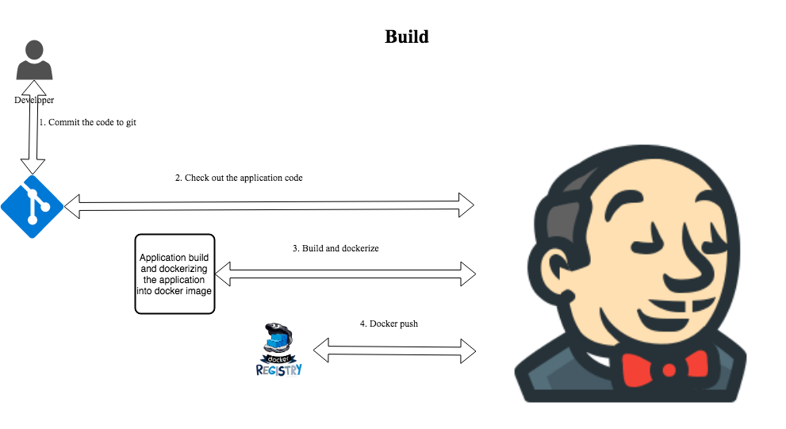
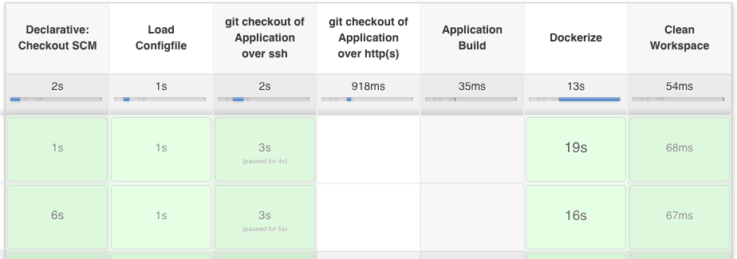

# Build

Build section of this pipeline does code check out, building the artifact, dockerize and push the docker image to the container registry.  

This support git checkout over both ssh and http(s) of the repository.



#### Prerequisites
1. Your application repository need to folder 'docker' which contains the dockerfile to dockerize the application.
2. Your application repository need to contain a bash shell file `build_app.sh` in its root directory which contain the build steps and copy the resultant artifact into the docker folder.  
Example bash shell for java gradle application will be live
```bash
#!/usr/bin/env bash
gradle build
cp -r build/libs/*.jar docker/app.jar
```
3. If you don't want any build to happen, then add steps to copy the necessary content into docker folder for dockerize the application.

#### Steps to create this Build pipeline for your components is as follows

1. Create a [jenkins pipeline](https://jenkins.io/doc/book/pipeline/getting-started/#defining-a-pipeline-in-scm)
2. Create the configuration file for your application using the configuration parameter defined below and save it under the config folder.
Example configuration to build and push to GCP
```groovy
env.APP_NAME = "application_name"
env.GIT_CREDENTIALS = "xXxXxXxX-xXxX-xXxX-xXxX-xXxXxXxXxXxX"
env.APP_GIT_URL = "giturl_come_here"
env.BUILD = "true"
env.JENKINSAGENT_NAME = "jenkins_slave_name"
env.CLOUD = "gcp"
env.PROJECTID = "myproject"
env.SERVICE_ACCOUNT = "my_gcp_service_account_name"
env.CREDENTIALSID = "my_jenkins_credential_name_of_my_gcp_service_account_name"
```
Example configuration to build and push to AWS
```groovy
env.APP_NAME = "application_name"
env.GIT_CREDENTIALS = "xXxXxXxX-xXxX-xXxX-xXxX-xXxXxXxXxXxX"
env.APP_GIT_URL = "giturl_come_here"
env.BUILD = "true"
env.JENKINSAGENT_NAME = "jenkins_slave_name"
env.CLOUD = "aws"
env.AWS_ACCOUNT_ID = "123123123123"
env.AWS_REGION = "us-east-1"
env.CREDENTIALSID = "my_jenkins_credential_name_of_my_gcp_service_account_name"

```
**TIP :**  you can name the configuration file with this format *build-APPLICATION_1-gcp.groovy* or *build-APPLICATION_NAME2-aws.groovy*  

3. Create following parameter for the pipeline
  - VERBOSE as 'Boolen Parameter'
  - CONFIGFILE as 'String parameter' pointing to the Configuration file created above.
  - JENKINSAGENT_NAME as 'String parameter' with defaultValue of the env.JENKINSAGENT_NAME
4. Under the pipeline section select 'Pipeline script from SCM'
5. Under SCM section, configure this git repository to checkout.
6. Set the 'Script Path' to 'jenkinsfile/build/Jenkinsfile'
7. Apply and save.
#### Following is the screenshot of a pipeline



#### Configuration Parameter for Build

The following tables list the configurable parameters of the Build jobs and their default values.


| Parameter                         | Description                                                 | Default                                   |
| --------------------------------- | ------------------------------------                        | ----------------------------------------- |
| `env.APP_NAME`                    | Name of the Application                                     | Required                                  |
| `env.GIT_CREDENTIALS`             | Jenkins Credentials id which is used by git                 | Required                                  |
| `env.APP_GIT_URL`                 | Application git repository URL.It can be ssh or http(s)     | Required                                  |
| `env.BUILD`                       | Whether application build should happen or not              |"true"                                     |
| `env.JENKINSAGENT_NAME`           | Name of the jenkins slave to run this job                   | Required                                  |
| `env.CREDENTIALSID`               |  Jenkins credentials ID holding cloud credentials           | Required                                  |  
| `env.CLOUD`                       | Name of the public cloud provider                           | "gcp" or "aws"                            |
| `env.PROJECTID`                   | Gcloud specific parameter;Name of the gcloud project        | Required                                  |
| `env.SERVICE_ACCOUNT`             | Gcloud parameter,Name of the gcloud service account         | Required                                  |
| `env.AWS_ACCOUNT_ID`              | AWS specific parameter; AWS service account https://console.aws.amazon.com/support/home?# check you account number under "Account number:" | Required |
| `env.AWS_REGION `                 | AWS specific parameter; AWS region name               | Required                                  |

#### What it does ?



#### FAQ

* How to create jenkins secret for http based checkout from git SCM ?

   creating jenkins secret for checkout code as follows, if using username and password for authentication in to github.
   ```
    Kind : username and password
   ```  
* How to create jenkins secret for ssh based checkout from git SCM ?

    if using ssh keys for authentication in to github.
     ```
      Kind : SSH Username with private key
     ```
* What commons.groovy contains?  
 commons.groovy contains the common parameter used accross all build jobs.So,you can move common configuration accross the project to a single place '/jenkinsfile/common-config/commons.groovy'. Example of this is git credentials, which mostly common accross all the builds.

 * I don't want any build to happen for my application.What should i do?  

   There are some case where, you don't have any source code for the application and no build step associated with them.In those case, you can use the above configuration,where there won't be any code checkout and build happening.
   Example of this is when you are build a wrapper around the dockerfile based of any other  dockerfile.
   ```
   env.BUILD_APP = "false"
   env.MANIFEST_GIT_URL = "NOT-APPLICABLE"
   ```

**TIP :**  store the gcloud service account as an jenkins secret and set the id of the secret as
`projectid`-`SERVICE_ACCOUNT`

**TIP :**  you can configure JENKINSAGENT_NAME as an hidden parameter which decide where this pipeline should execute.
