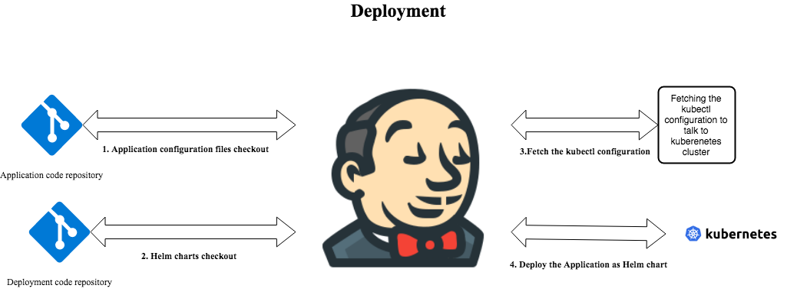
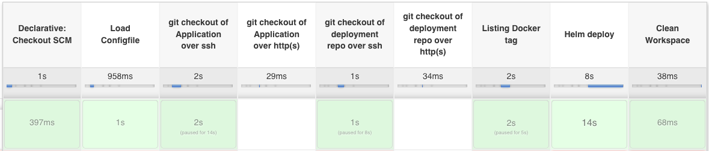

 # Deploy
Deploy section of this pipeline does the application deployment into kubernetes cluster as helm chart.



#### Prerequisites
1. Your deployment configuration repository need to contain folder as '/helm/values/${CLOUD}/${ENVIRONMENT}/values.yaml', where CLOUD represent the cloud provider - aws or gcp, ENVIRONMENT represent the environment where you deploying - dev,stg,prod etc.
2. values.yaml file contains the helm parameter to be passed to the helm chart.
3. If you have any other parameter to passed to helm you can pass them as jenkins parameter with the name 'HELMS_EXTRA_OPS'.

#### Steps to create this Build pipeline for your components is as follows

1. Create a [jenkins pipeline](https://jenkins.io/doc/book/pipeline/getting-started/#defining-a-pipeline-in-scm)
2. Create the configuration file for your application using the configuration parameter defined below and save it under the config folder.  
Example deployment configuration for GCP
```groovy
env.APP_NAME = "application_name"
env.JENKINSAGENT_NAME = "jenkins_slave_name"
env.CLOUD = "gcp"
env.PROJECTID = "myproject"
env.SERVICE_ACCOUNT = "my_gcp_service_account_name"
env.CREDENTIALSID = "my_jenkins_credential_name_of_my_gcp_service_account_name"
env.CR_CREDENTIALSID = "my_jenkins_credential_name_of_my_gcp_service_account_name"
env.ENVIRONMENT = "dev"
env.APP_GIT_URL = "giturl_come_here"
env.GIT_CREDENTIALS = "xXxXxXxX-xXxX-xXxX-xXxX-xXxXxXxXxXxX"
env.DEPLOYMENT_CONFIG_GIT_URL = "giturl_come_here"
env.DEPLOYMENT_GIT_CREDENTIALS = "xXxXxXxX-xXxX-xXxX-xXxX-xXxXxXxXxXxX"
env.KUBERNETES_CLUSTER = "kubernetes_cluster"
env.CLOUD_ZONE = "south-north-Z"
env.KUBERNETES_NAMESPACE = "development_namespace"
```
Example deployment configuration for AWS
```groovy
env.APP_NAME = "application_name"
env.JENKINSAGENT_NAME = "jenkins_slave_name"
env.CLOUD = "aws"
env.AWS_ACCOUNT_ID = "123123123123"
env.AWS_REGION = "us-east-1"
env.CREDENTIALSID = "xXxXxXxX-xXxX-xXxX-xXxX-xXxXxXxXxXxX"
env.ECR_AWS_ACCOUNT_ID = "123123123123"
env.ECR_AWS_REGION = "us-east-1"
env.CR_CREDENTIALSID = "xXxXxXxX-xXxX-xXxX-xXxX-xXxXxXxXxXxX"
env.ENVIRONMENT = "dev"
env.APP_GIT_URL = "giturl_come_here"
env.GIT_CREDENTIALS = "xXxXxXxX-xXxX-xXxX-xXxX-xXxXxXxXxXxX"
env.DEPLOYMENT_CONFIG_GIT_URL = "giturl_come_here"
env.DEPLOYMENT_GIT_CREDENTIALS = "xXxXxXxX-xXxX-xXxX-xXxX-xXxXxXxXxXxX"
env.KUBERNETES_CLUSTER = "kubernetes_cluster"
env.KUBERNETES_NAMESPACE = "development_namespace"

```
**TIP :**  you can name the configuration file with this format *deploy-APPLICATION_NAME1-ENVIRONMENT-gcp.groovy* or *deploy-APPLICATION_NAME2-ENVIRONMENT-aws.groovy*  

3. Create following parameter for the pipeline
  - VERBOSE as 'Boolen Parameter'
  - CONFIGFILE as 'String parameter' pointing to the Configuration file created above.
  - JENKINSAGENT_NAME as 'String parameter' with defaultValue of the env.JENKINSAGENT_NAME
  - HELMS_EXTRA_OPS as 'String parameter' for passing any extra options to be passed to helms chart.Example : --debug
4. Under the pipeline section select 'Pipeline script from SCM'
5. Under SCM section, configure this git repository to checkout.
6. Set the 'Script Path' to 'jenkinsfile/deploy/Jenkinsfile'
7. Apply and save.
#### Following is the screenshot of a deployment pipeline



#### Configuration Parameter for Deployment

The following tables list the configurable parameters of the Deployment jobs and their default values.


| Parameter                         | Description                                                         | Default                                   |
| --------------------------------- | ------------------------------------                                | ----------------------------------------- |
| `env.APP_NAME`                    | Name of the Application                                             | Required                                  |
| `env.JENKINSAGENT_NAME`           | Name of the jenkins slave to run this job                           | Required                                  |
| `env.CLOUD`                       | Name of the public cloud provider                                   | "gcp" or "aws"                            |
| `env.ENVIRONMENT`                 | Name of the Environment                                             | Required                                  |
| `env.APP_GIT_URL`                 | Application git repository URL.It can be ssh or http(s)             | Required                                  |
| `env.GIT_CREDENTIALS`             | Jenkins credentials ID holding git credentials to checkout Application git repository.| Required                |  
| `env.DEPLOYMENT_CONFIG_GIT_URL`   | Deployment git repository URL.It can be ssh or http(s)              | Required                                  |
| `env.DEPLOYMENT_GIT_CREDENTIALS`  | Jenkins credentials ID holding git credentials to checkout Deployment git repository | Required                 |  
| `env.KUBERNETES_CLUSTER`          | Name of the kubernetes cluster                                      | Required                                  |
| `env.KUBERNETES_NAMESPACE`        | Name of the kubernetes Namespace to deploy                          | Required                                  |
| `env.CREDENTIALSID`               | Jenkins credentials ID which holds cloud credentials                  | Required                                  |  
| `env.PROJECTID`                   | Gcloud specific parameter;Name of the gcloud project                | Required                                  |
| `env.SERVICE_ACCOUNT`             | Gcloud specific parameter;Name of the gcloud service account        | Required                                  |
| `env.CLOUD_ZONE`                  | Gcloud specific parameter;Name of the google cloud zone             | Required                                  |
| `env.AWS_ACCOUNT_ID`              | AWS specific parameter; AWS service account https://console.aws.amazon.com/support/home?# check you account number under "Account number:" | Required |
| `env.AWS_REGION `                 | AWS specific parameter; AWS region name                             | Required                                  |
| `env.ECR_AWS_ACCOUNT_ID`          | AWS cloud specific parameter; AWS service account of ECR https://console.aws.amazon.com/support/home?# check you account number under "Account number:" | Required |
| `env.ECR_AWS_REGION `             | AWS specific parameter; AWS region name of ECR                | Required                                        |
| `env.CR_CREDENTIALSID`           | Jenkins credentials ID holding cloud credentials of ECR             | Required                                  |  

#### What it does ?




#### FAQ

 - why do we need a separate deployment repository for each application ?

   Deployment repository for each application contains the information
required for doing the deployment.some of the additional information required are
the helm chart,sidecar deployment configuration. We can have these inside the
application source code repository itself,but it is better to have the Deployment
configuration as a separate repository for keeping thing simpler and clean.

 - Do you need any additional tools for deploying in AWS cloud?  
  [aws-iam-authenticator](https://github.com/kubernetes-sigs/aws-iam-authenticator)
