# Image Promote

Promote the docker to higher environment by adding new docker tag.
You can pull docker image from one public cloud docker container registry and push it into another
cloud docker container registry.


#### Steps to create this Image pipeline for your components is as follows

1. Create a [jenkins pipeline](https://jenkins.io/doc/book/pipeline/getting-started/#defining-a-pipeline-in-scm)
2. Create the configuration file for your application using the configuration parameter defined below and save it under the config folder.
Example configuration to pull and push from google GCR
```groovy
env.APP_NAME = "application_name"
env.JENKINSAGENT_NAME = "jenkins_slave_name"
env.SRC_CLOUD = "gcp"
env.SRC_PROJECTID = "myproject"
env.SRC_SERVICE_ACCOUNT = "my_gcp_service_account_name"
env.SRC_CREDENTIALSID = "my_jenkins_credential_name_of_my_gcp_service_account_name"
env.SRC_ENVIRONMENT = "dev"
env.DST_ENVIRONMENT = "stg"
env.DST_CLOUD = "gcp"
env.DST_PROJECTID = "myproject"
env.DST_SERVICE_ACCOUNT = "my_gcp_service_account_name"
env.DST_CREDENTIALSID = "my_jenkins_credential_name_of_my_gcp_service_account_name"
```
Example configuration to pull and push from Amazon ECR
```groovy
env.APP_NAME = "application_name"
env.JENKINSAGENT_NAME = "jenkins_slave_name"
env.SRC_CLOUD = "aws"
env.SRC_AWS_ACCOUNT_ID = "123123123123"
env.SRC_AWS_REGION = "us-east-1"
env.SRC_CREDENTIALSID = "my_jenkins_credential_name_of_my_AWS"
env.SRC_ENVIRONMENT = "dev"
env.DST_ENVIRONMENT = "stg"
env.DST_CLOUD = "aws"
env.DST_AWS_ACCOUNT_ID = "123123123123"
env.DST_AWS_REGION = "us-east-1"
env.DST_CREDENTIALSID = "my_jenkins_credential_name_of_my_AWS"

```
Example configuration to pull from google GCR and push to Amazon ECR
```groovy
env.APP_NAME = "application_name"
env.JENKINSAGENT_NAME = "jenkins_slave_name"
env.SRC_CLOUD = "gcp"
env.SRC_PROJECTID = "myproject"
env.SRC_SERVICE_ACCOUNT = "my_gcp_service_account_name"
env.SRC_CREDENTIALSID = "my_jenkins_credential_name_of_my_gcp_service_account_name"
env.SRC_ENVIRONMENT = "dev"
env.DST_ENVIRONMENT = "stg"
env.DST_CLOUD = "aws"
env.DST_AWS_ACCOUNT_ID = "123123123123"
env.DST_AWS_REGION = "us-east-1"
env.DST_CREDENTIALSID = "my_jenkins_credential_name_of_my_aws"
```
Example configuration to pull from Amazon ECR and push to  google GCR.
```groovy
env.APP_NAME = "application_name"
env.JENKINSAGENT_NAME = "jenkins_slave_name"
env.SRC_CLOUD = "aws"
env.SRC_AWS_ACCOUNT_ID = "123123123123"
env.SRC_AWS_REGION = "us-east-1"
env.SRC_CREDENTIALSID = "my_jenkins_credential_name_of_my_AWS"
env.SRC_ENVIRONMENT = "dev"
env.DST_ENVIRONMENT = "stg"
env.DST_CLOUD = "gcp"
env.DST_PROJECTID = "myproject"
env.DST_SERVICE_ACCOUNT = "my_gcp_service_account_name"
env.DST_CREDENTIALSID = "my_jenkins_credential_name_of_my_gcp_service_account_name"
```
**TIP :**  you can name the configuration file with this format *promote-APPLICATION_1-SOURCE_DESTINAME.groovy*. For example, 'promote-javapp1-dev-stg.groovy' can be name of the configuration file of javapp1 application to promote image from development to staging.

3. Create following parameter for the pipeline
  - VERBOSE as 'Boolen Parameter'
  - CONFIGFILE as 'String parameter' pointing to the Configuration file created above.
  - JENKINSAGENT_NAME as 'String parameter' with defaultValue of the env.JENKINSAGENT_NAME
4. Under the pipeline section select 'Pipeline script from SCM'
5. Under SCM section, configure this git repository to checkout.
6. Set the 'Script Path' to 'jenkinsfile/promote/Jenkinsfile'
7. Apply and save.

#### Following is the screenshot of a Promote pipeline


#### Configuration Parameter for Image promote

The following tables list the configurable parameters of the Image promote jobs and their default values.

| Parameter                         | Description                                                         | Default                                   |
| --------------------------------- | ------------------------------------                                | ----------------------------------------- |
| `env.APP_NAME`                    | Name of the Application                                             | Required                                  |
| `env.JENKINSAGENT_NAME`           | Name of the jenkins slave to run this job                           | Required                                  |
| `env.SRC_CLOUD`                   | Name of the public cloud provider                                   | "gcp" or "aws"                            |
| `env.DST_CLOUD`                   | Name of the public cloud provider                                   | "gcp" or "aws"                            |
| `env.SRC_ENVIRONMENT`             | Source Environment of the docker image                              | Required                                  |
| `env.DST_ENVIRONMENT`             | Destination Environment for the docker image                        | Required                                  |
| `env.SRC_CREDENTIALSID`           | Jenkins credentials ID which holds cloud credentials                | Required                                  |
| `env.DST_CREDENTIALSID`           | Jenkins credentials ID which holds cloud credentials                | Required                                  |
| `env.SRC_PROJECTID`               | Gcloud specific parameter;Name of the gcloud project to pull the docker image   | Required                      |
| `env.SRC_SERVICE_ACCOUNT`         | Gcloud specific parameter;Name of the gcloud service account for docker pull    | Required                      |
| `env.DST_PROJECTID`               | Gcloud specific parameter;Name of the gcloud project to push the docker image   | Required                      |
| `env.DST_SERVICE_ACCOUNT`         | Gcloud specific parameter;Name of the gcloud service account for docker push    | Required                      |
| `env.SRC_AWS_ACCOUNT_ID`          | AWS cloud specific parameter; AWS service account of ECR https://console.aws.amazon.com/support/home?# check you account number under "Account number:"  | Required                      |
| `env.DST_AWS_ACCOUNT_ID`          | AWS cloud specific parameter; AWS service account of ECR https://console.aws.amazon.com/support/home?# check you account number under "Account number:"  | Required                      |
| `env.SRC_AWS_REGION`              | AWS specific parameter; AWS region name of ECR                       | Required                                 |
| `env.DST_AWS_REGION`              | AWS specific parameter; AWS region name of ECR                       | Required                                 |

#### What it does ?



#### FAQ
- Can i promote from aws container registry to gcp container registry or vice versa?  
  yes, it is possible
