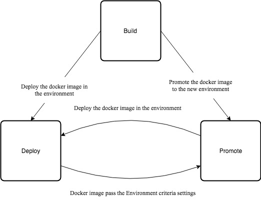

# Kash BDP Pipeline

## What is it ?
BDP stands for Build Deploy Promote.  
It is Build and Deployment Pipeline as Code.
This is a set of three building blocks made up of declearative jenkinsfile,when combined other components - test suite,vulnerability scanning,etc., will become a complete CI/CD system of your choice. You can use these block for your application and combine with your test suites(unit tests, regression tests,stress tests) to build your own CI/CD.
Three building blocks are namely build, deploy and promote.
This pipeline can be used to dockerize the application and deploy in kubernetes platform
provided by various cloud providers - gcp,aws.(other clouds coming soon)

These building blocks are primitive, each serves a single purpose.

Build - code check out, building the artifact, dockerize and push the docker image to the container registry.

Deploy - Deploy the application as helm chart

Promote - promote the docker to higher environment by adding new docker tag.

These building blocks can be cascaded and combined with each other as per the need and
can form a complete continuous integration and continous deployment pipeline.
Build, deploy and promote blocks are build as jenkins files.

## Feature
  - Ability to support parallel execution of the build job, deployment job, image promotion job.Execution of one job should not affect other job
  - Jenkins configuration are passed to building block as files.This results in minimum changes in jenkins job configuration.
  - [Cleanup of unwanted Docker image - will be discussing in detail separately](ImageCleanup.md).
  - mechanisms by which some special docker images that are excluded from Clean as mention above.These special images are called as [Static images](StaticImages.md).
  - Ability to have separate configuration from application for each environment and region as recommended by 12factor
  - Ability to pull and push docker images to different different public cloud container registries.
  - Supports code checkout of over both http and ssh.
## Software Prerequisites
  - Jenkins version. 2.176.2
  - Kubectl Major:"1", Minor:"15", GitVersion:"v1.15.1"
  - aws-cli/1.16.209
  - aws-iam-authenticator
  - Google Cloud SDK 256.0.0
  - docker Client 18.03.1-ce
  - [Helm](https://helm.sh) v2.14.3
## How To's
  - [How to setup Kash BDP pipeline for Google cloud](GCP_InitialSetup.md)
  - [How to setup Kash BDP pipeline for AWS ](AWS_InitialSetup.md)
  - [How to create a Build job for you application?](Build.md)
  - [How to Deploy your application?](Deploy.md)
  - [How to do Docker image promotion?](Promote.md)
## ToDo
  - To support Azure cloud
