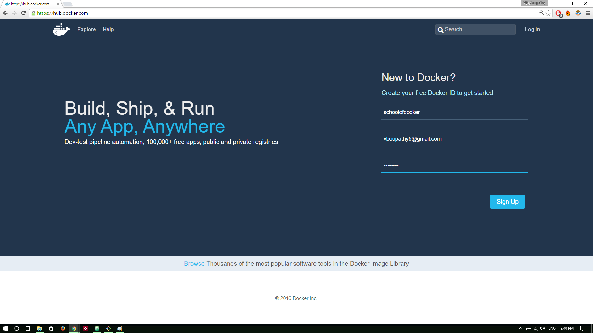
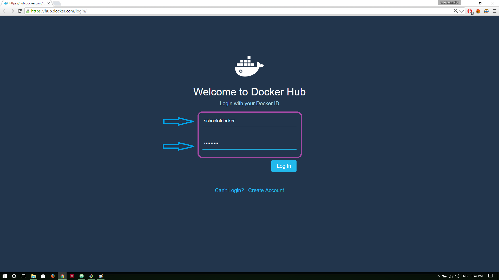
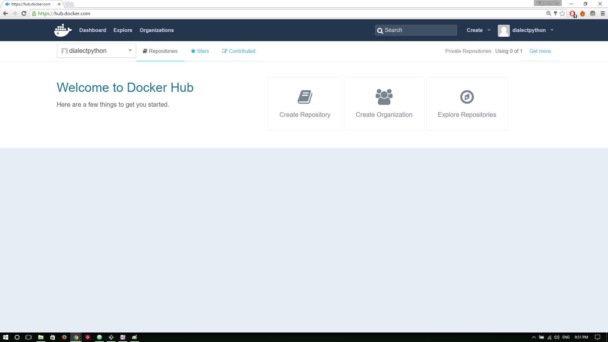
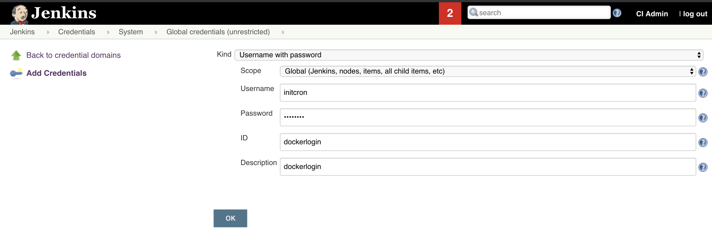

# Packaging with Docker


In addition to helping  the process of building and testing software, docker could also provide a standard packaging format i.e. docker images.   Along with this packaging format, comes the distribution mechanism i.e.  docker image registries.   

In this lab you are going to learn,

  * about Docker’s standard imaging format
  * How to test build docker images  manually
  * Learn how to write Dockerfiles
  * understand the automated, iterative docker image process
  * add docker packaging stage to the jenkins pipeline
  * create per stage agent configurations in Jenkinsfile


##  Registering with the DockerHub   

Since you  are going to start working with the registry, build and push images to it later, its essential to have your own account on the registry. For the purpose of this tutorial, you are going to use the hosted registry i.e. Dockerhub.

Steps to create Dockerhub account

#### Step 1:  
Visit the following link and sign up with your email id  
  **https://hub.docker.com/**

  

#### Step 2:  
Check your email inbox and check the activation email sent by docker team

#### Step 3:  
After clicking on the activation link, you will be redirected to a log in page. Enter your credentials and log in

  

You will be launched to Dockerhub main page. Now the registration process is complete and you have account in Dockerhub!

  

## Lab: Building Docker Images - A manual approach  

Before you start building automated images, you are going to create a docker image by hand. you have already used the pre built image from the registry in the last session. In this sub section, you are going to create an image with worker application installed. Since worker  is a java based application, and needs maven to build it,  you will base our work on existing official image for **maven**.


  * Clone Repository for Java worker app

  ```
  git clone https://github.com/schoolofdevops/example-voting-app.git
  ```

  * Launch an intermediate container to install worker app

  Create a Container with  **schoolofdevops/voteapp-mvn:v1** image

  ```
  docker run -idt --name build maven:3.6.1-jdk-8-slim sh
  ```

  * Copy over the Source Code
  ```
  cd example-voting-app/worker
  docker container cp .  build:/app
  ```

  * Connect to container to compile and package the code


  ```
  docker exec -it build sh

  mvn package

  ```

  * Verify jarfile has been built

  ```
  ls target/

  java -jar target/worker-jar-with-dependencies.jar
  ```

  [sample output]
  ```
  /app # java -jar target/worker-jar-with-dependencies.jar
  Waiting for redis
  Waiting for redis
  Waiting for redis
  Waiting for redis
  Waiting for redis
  Waiting for redis
  ^c
  ```
  [use ^c to exit]

  The above is the expected output. The **worker** app keeps waiting for **redis** and then later **db** in a loop.


  * Move the artifact, remove source code
  ```

  mv target/worker-jar-with-dependencies.jar /run/worker.jar

  rm -rf /app/*

  exit
  ```

  * Commit  container to an image

    * Exit from the container shell
    * Note container ID

  Commit the container into a image  as,

  ```

  docker container commit build  <docker hub user id >/worker:v1

  ```

  Test before pushing  by launching container with the packaged app

  ```
    docker run --rm -it  <docker hub user id >/worker:v1 java -jar /run/worker.jar
  ```

  * Push Image to registry

  Before you push the image, you need to be logged in to the registry, with the docker hub id created earlier. Login using the following command,

  ```
  docker login
  ```

  To push the image, first list it,

  ```
  docker image ls
  ```

  [Sample Output]

  ```
  REPOSITORY                   TAG                 IMAGE ID            CREATED             SIZE
  initcron/worker         v2              90cbeb6539df        18 minutes ago      194MB
  initcron/worker         v1              c0199f782489        34 minutes ago      189MB

  ```

  To push the image,


  ```
  docker push <dockrhub user id>/worker:v1
  ```


## Lab: Building Images with Dockerfile

Now, lets build the same image, this time with Dockerfile. To do this, create a file by name **Dockerfile** in the root of the source code.

`file: example-voting-app/worker/Dockerfile`

```
FROM maven:3.6.1-jdk-8-slim

WORKDIR /app

COPY .  .

RUN mvn package && \
    mv target/worker-jar-with-dependencies.jar /run/worker.jar && \
    rm -rf /app/*

CMD java  -jar /run/worker.jar

```


Lets now build the image

```
cd example-voting-app/worker

docker image build -t <dockrhub user id>/worker:v2 .

docker image ls

```

Try building again,

```
docker image build -t <dockrhub user id>/worker:v2 .

```

This time, it does not build everything, but uses cache.


Testing the image

```
docker container run --rm -it  <dockrhub user id>/worker:v2

```


Tag the image as latest,

```
docker image tag  <dockrhub user id>/worker:v2  <dockrhub user id>/worker:latest

docker image ls

```

Finally, publish it to the registry,

```
docker image push <dockrhub user id>/worker:latest

docker image push <dockrhub user id>/worker

```


## Adding docker build stage to Jenkinsfile

  * Add  username/password type credential to Jenkins with name **dockerlogin**. Do do so, browse to `Jenkins -> Credentials -> Jenkins -> Global Credentials -> Add Credentials -> Username and password ` . Ensure you add the dockerhub login and password with id as **dockerlogin**.
  
  * Refactor the Jenkinsfile for worker app by adding the following stage


`file: worker/Jenkinsfile`

```
stage('docker-package'){
    agent any
    steps{
      echo 'Packaging worker app with docker'
      script{
        docker.withRegistry('https://index.docker.io/v1/', 'dockerlogin') {
            def workerImage = docker.build("xxxx/worker:v${env.BUILD_ID}", "./worker")
            workerImage.push()
            workerImage.push("latest")
        }
      }
    }
}
```

You have configured the pipelines to run with docker agents. However, the job to create and publish docker image needs to be run directly from the Jenkins server as thats where you have configured docker client to run. In order to support it, you would have to refactor the worker/Jenkinsfile to support per stage agents.

```
pipeline{

    agent none

    stages{
        stage('build'){
            agent{
              docker{
               image 'maven:3.6.1-jdk-8-slim'
               args '-v $HOME/.m2:/root/.m2'
              }
            }

            steps{
                echo 'building worker app'
                dir('worker'){
                  sh 'mvn compile'
                }
            }
        }
        stage('test'){
            agent{
              docker{
               image 'maven:3.6.1-jdk-8-slim'
               args '-v $HOME/.m2:/root/.m2'
              }
            }
            steps{
                echo 'running unit tests on worker app'
                dir('worker'){
                  sh 'mvn clean test'
                }
            }
        }
        stage('package'){
            agent{
              docker{
               image 'maven:3.6.1-jdk-8-slim'
               args '-v $HOME/.m2:/root/.m2'
              }
            }
            steps{
                echo 'packaging worker app into a jarfile'
                dir('worker'){
                  sh 'mvn package -DskipTests'
                  archiveArtifacts artifacts: '**/target/*.jar', fingerprint: true
                }
            }
        }
        stage('docker-package'){
            agent any
            steps{
              echo 'Packaging worker app with docker'
              script{
                docker.withRegistry('https://index.docker.io/v1/', 'dockerlogin') {
                    def workerImage = docker.build("initcron/worker:v${env.BUILD_ID}", "./worker")
                    workerImage.push()
                    workerImage.push("latest")
                }
              }
            }
        }
    }

    post{
        always{
            echo 'the job is complete'
        }

    }

}
```
