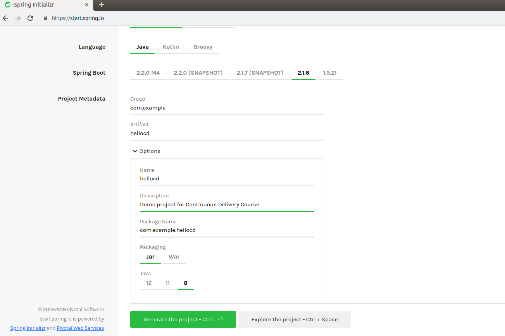
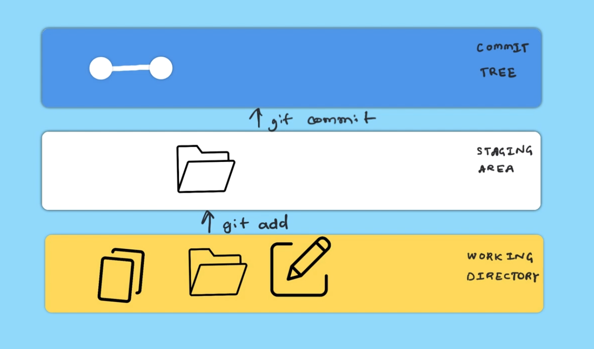
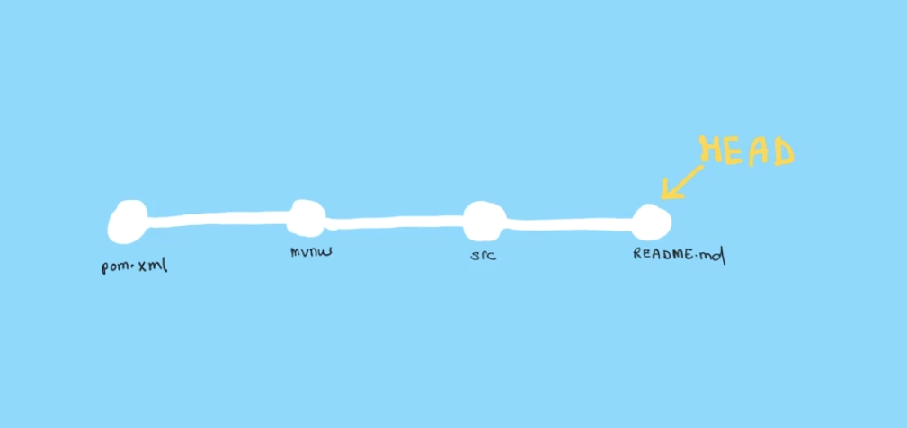
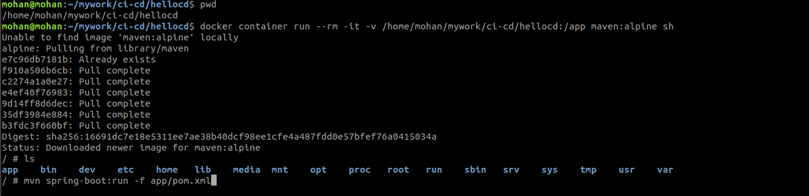
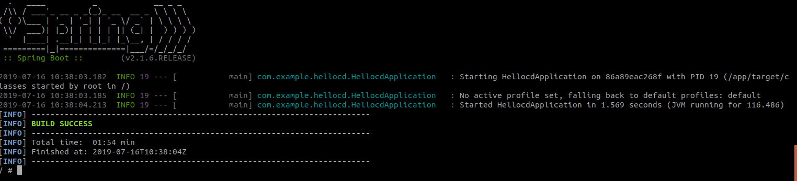
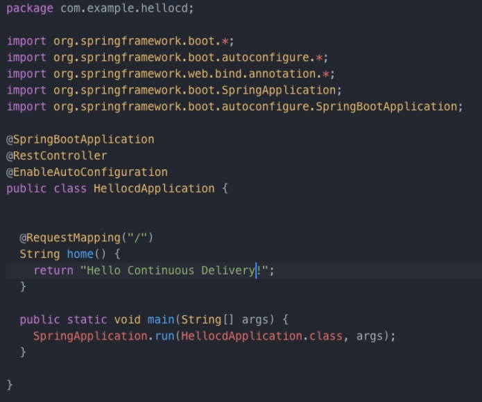
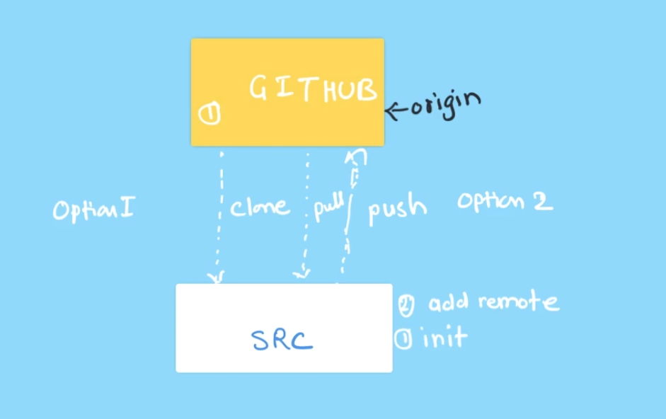
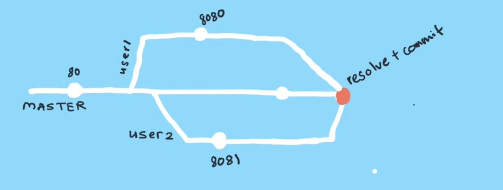

# Revision Control with Git

In this lab, you will learn


  * How to configure a git client,
  * create and work with repositories
  * basics of revision control operations
  * branching and merging
  * working with remotes  
  * resolving conflicts   ( and also )
  * leveraging docker for local development


## Configuring git client

Before you are start revision control, you need to configure git.There are three different places you can configure git, that are explained here.

Git configs

| Type     | Scope     | Config Path     |
| :------------- | :------------- | :------------- |
| LOCAL       | Repo       | .git/config |
| GLOBAL       | User      | /home/user/.gitconfig |
| SYSTEM       | System       | /etc/gitconfig |


You would create configurations with user scope, valid for all repositories the current user creates.

```
 git config --global user.name "username"
 git config --global user.email "user@gmail.com"
 git config -l
 cat ~/.gitconfig
```

You could also create additional configurations e.g. editor

```
 git config --global core.editor vim
 git config -l
 git config -e --global
```

## Creating a sample application

Here you will create a simple *hello-world* application using java based spring boot framework.To create the application visit [startspringboot](https://start.spring.io/).

Once you visit this page, change your artifact name and description. [Click Generate!](./images/nextcloud1.png) to download your application.


After downloading the  application code, move that zip file to your local working directory and unzip that application. you will use this application for revision control operations and writing simple web application.  

```
unzip hellocd.zip
```


## Basics of revision control


Now that you have  a hellocd application created and downloaded, you could   use that to learn  revision control operations.

You could begin by initializing the repo

```
 cd hellocd
 git init .
 git status
```

Once you check git status it will show all the current files as untracked. You need to add these files so that git starts tacking it. You could use the following commands to start tracking the files in hellocd project with git.

```
 git add pom.xml
 git commit
 git status
 git add src
 git add *
 git commit mvnw
 git commit -am "adding files created with spring boot generator"
 git log
```
### Three trees of Git

Previously you  added and committed all files using git commands. Lets learn what happened when you did that by understanding the three trees of git.

  * You began by tracking the files in working directory
  * then added those to the staging area and
  * then started tracking with git by  adding those to  commit tree.

Following image should explain this process



git logs will shows you commit history and git status show you new file or untracked file in your directory. you just add one more file in your working directory `README.md`and then check your git status after that commit that using reset.

```
 git add README.md
 git status
 git reset README.md
 git add README.md
 git commit -am "adding README"
```

In this you have added and commited the files one by one, that flow chat is given following and this is the current state of your repository.



## Using docker in development

After creating a java project based on maven, you may wish to build it. Beginning with  compilation followed by testing, it could then be deployed into an environment.  To do this, you would need a build environment. Instead of setting up and then managing a build environment with maven, java etc. you could leverage docker's important feature here, disposability.   

Use the following command to run the container.

Note: Before you run this command, you need to find out the absolute path for the directory where you are running this from (e.g. hellocd). You could dind it by running `pwd` command.

```
docker container run --rm -it -v /absolute/path/to/ci-cd/hellocd:/app maven:alpine sh
```

Running  above command, should get you a,

  * disposable container environment with docker
  * created with image maven:alpine
  * that should have the build tools including maven, java etc.
  * and exiting this container would delete it as we are using --rm options

while inside the container, you could attempt to build the project as,

```
 mvn spring-boot:run -f app/pom.xml
```




And run it with,


```
mvn spring-boot:run -f app/pom.xml
```




You could see your libraries are stored in `/root/.m2/` directory. you can reduce the time to download libraries by creating a volume which can then be mounted at this path.

```
 docker volume create m2

 docker container run --rm -it -v m2:/root/.m2 -v /Users/gouravshah/learn/ci-cd/hellocd:app maven:alpine mvn spring-boot:run -f /app/pom.xml
```

When you  run `docker container run` again, you should notice the build being faster due to maven packaes being cached with the newly mounted  volume.


## Getting started with Branching and Merging


You could create branch using `git branch` command and switch it to that branch using `git checkout`.  Default branch is master, whenever you need to work on other branch, you could use `git checkout`.


```
 git branch --list
 git log
 git branch webapp
 git branch --list
 git branch checkout webapp
```


Instead of using a two step process, You could  create a branch and  switch to it with,


```
git checkout -b webapp
```

You can delete your branch using `git branch -d`. Before deleteing the branch you should switch to another.


```
git checkout master
git branch -d webapp
```


### Adding a new feature by branching out


Now you are going to add a new  features to your application,

  * source code changes visit [lfs261devops-repo](https://github.com/lfs261/devops-repo) and goto `hellocd` directory copy `HellocdApplication.java.v1` code and replace the `HellocdApplication.java` in your `src/main/java/com/example/hellocd directory`.
  * copy `pom.xml.snippet1` from  above   url and add it to  `pom.xml` file under dependency section.

Now you can check your git status, the result will be those files you have  changed  are in untracked. You can check changes by using `git diff` and you could commit after `git add` else directly commit by using `git commit -a` with the editor.


```
 git add pom.xml
 git commit -a
 git status
```

Now you can see the changes are in new branch, Master still  does not ave any of those incorporated yet.  This is the safer way of bringing your code to master. With the next sub section, you would learn how to bring these changes in to the master.


### Merging with commit history

Previously you have made some changes and committed to a  new branch *webapp*.  Its now time to test the application.

Again run the same spring-boot container command with port mapped to `8080` on host


```
docker container run --rm -it -v m2:/root/.m2 -v /Users/gouravshah/learn/ci-cd/hellocd:app -p 8080:8080 maven:alpine mvn spring-boot:run -f /app/pom.xml
```


Once the container is running you can visit the application on `http://IPADDRESS:8080`, but you will get some error due to some snippet missing on `HellocdApplication.java`. To fix this issue you could  copy `HellocdApplication.java.v2` from the devops-repo and replace entirely.

After replacing the snippet run the following commands to commit.
```
 git diff
 git commit -am "added missing annotations"
```

Again run your spring-boot container and visit `localhost:8080`. You should now see hello world on your browser.

You could change to `hello Continuous Delivery` instead of `hello world` in `HellocdApplication.java` and commit that, again run your container. Now you can see `hello Continuous Delivery` in the browser.



Now that the  feature is added, its time to incorporate these changes in to master by using `git merge`. Before you do so,  make sure you switch to the  master branch first.


```
 git checkout master
 git merge webapp
 git log
```


If you don't want to continue new feature branch then delete that by using `git branch -d` and total branch workflow is given following for your reference.

```
 git branch -d webapp
```


## Working with Remotes

You could collaborate and works with different branches, users or central repository by using remotes.Here your central repository is github, actually you work with is as the remote and clone from github or create the code, initialize and push the code into the github repository.

Before start you need to create account in github, visit the [github](https://github.com/) link to create your account.
while create account use free account option.

Once you create an account, create a new hellocd public repository. You have two ways to work with repository, first is like you could use initialized repository or second one is clone the repository form github and make changes and push to your repository.

Here you are already initialized a repository, now you need to add newly created repository as a origin by using following command and push your application to that origin master,
```
 git remote add origin https://github.com/initcron/hellocd.git
 git remote show
 git remote show origin
 git push origin master
```   

Once you push to origin master, you can see your code in the repository with commit what you have changed.


## Resolving conflicts

Just like in real life, when you are collaborating with others, conflicts may happen. Git provide you various options to resolve those.


Add `sever.port=80` in `src/main/resource/application.properties` while you are on the  master branch, commit and push.

```
 git diff
 git commit -am "added server port 80"
 git push origin master
```

### Creating a Conflict

To resolve a conflict, first we would have to create one, to the least simulate it. TO do that, you would be creating two branches, and updating the same file with different content from those. Following sequence of commands would help you do that.

You have an option to work in pairs here. The commands are differenciated with *user1* and *user2*. Make sure you are working with the same repository in case of a pair. If you can not come up with a pair, go ahead and run both blocks of commands from the same workspace.


user1: use the following code
```
 git checkout -b user1

 ```
 set value of  server.port to 8080 in `src/main/resource/application.properties`

 ```
 git diff
 git commit -am "this should run on port 8080"
 git push origin user1
```
user2: use the following
```
 git checkout -b user2

```

set value of  server.port to 8081 in `src/main/resource/application.properties`

```
 git diff
 git commit -am "this should run on port 8081"
 git push origin user2
```

Once you do the above,  switch to the  master branch and try to merge the branches you just updated, simultaneously.


user1:

```
 git checkout master
 git pull origin user2
 git log
 git push origin master
```

user2:
```
git checkout master
git pull origin user1
git log
git push origin master
```

You should get a conflict here.  Use `git log` to  check the details.

### Manually resolving a Conflict

You could resolve a conflict manually by editing the file in conflict. In this example,  You could pick one value for  `server.port` and keep that line in the file. Remove everything else including the lines staring with <<<<<<<< and >>>>>>>>>. Once you do so, add it back and merge as,


```
 git add src/main/resource/application.properties
 git commit -a
 git push origin master
```


Validate by examining the  commit history.

```
git log
```




Once you complete this, delete your user1 & user2 branches by using following commands,

```
 git branch -d user1
 git branch -d user2
 git push origin --delete user1
 git push origin --delete user2
```

## Learning to Undo

Its common to add changes to the commit history and later wish you could have taken those back. At times, there are silly mistakes, or bugs you detect in your feature branches, that do not need to reflect in the commit history. There are often times, when you may wish to unstage s file.  Git offers reset  command with its options to achieve this.


Lets add a change that we would undo later.

```
 git checkout -b config
 git branch
```

Update  `src/main/resource/application.properties` with  `server.port=9000`

```
 git status
 git add src/main/resource/application.properties
 git status
```

The file is now been staged. To unstage the same,

```
 git reset src/main/resource/application.properties
 git status
```


```
 git diff
 git commit -am "changed port to 9000"
 git log
 git push origin config
```

You have not only added it to a commit history but also   pushed the change to the remote.
You just realised that port configured `9000` should just be  `8080`.  Now you are wondering how to bring that change back.

Git reset can come in handy here as well, however, this time since its been added to commit history, you would have to use a special option to undo this time.


Try using the following command,
```
 git reset HEAD~1

```

  * This should revert the last commit and point the HEAD (tip of the git repo) to the previous commit
  * You could use HEAD~2, HEAD~3 to shift the  HEAD back by  two/three commits respectively
  * You could optionally use the commit id to shift HEAD to a specific commit   


What you did above was a soft reset. Meaning, the undo was done for the commit history only. You would still see the files  in the staging area, and current working tree being unchanged.
You could undo it all the way ( this is a destructive process) by doing a  hard reset as,

```
git reset --hard HEAD~1
```

Once you reset,if you try to push with the changes to remote,  it should give you a error. To undo changes to remote, use force option.

```
git push origin config -f
```

### Revert vs Reset


Reset is useful while working on feature/personal  branches. However, when you have a collaborative workflow, with common branches such as trunk/mainline/master, resetting changes on common branches  could leave everyone else confused and in inconsistent state.   THis is because reset wipes out the commits to undo changes. A cleaner solution in such  cases is using `git revert` instead, which undoes the changes, however by adding a new commit, which is then part of the commit history, leaving everyone in sync.   

To learn  how revert works, lets first update a file and commit it.

You could config2 branch and  file and commit the changes in feature branch, bring those changes to master branch using following commands,
```
 git checkout -b config2

```
Update `src/main/resource/application.properties` with   `service.port=7000`

```
 git diff
 git commit -am "run on port 7000"
 git push origin config2
 git checkout master
 git pull origin config2
 git push origin master
```
Now that you have incorporated these changes to the master branch, its time to revert.

```
 git log
 git revert HEAD
      (or)
 git revert 5080dcc9d13ac920b5867891166a
```

where, 5080dcc9d13ac920b5867891166a is the previous commit id that you would want to revert.


Once you revert, you need sync changes in master branch with remote by using following command.

```
 git log
 git push origin master
```


Once sync the changes, it will show the changes to your co-developer and delete your config2 branch after git revert.

Go ahead and delete the branch after you are done with, 

```
 git branch delete config2
 git push origin :config2
```

## Exercise:  Working with github

You have been tasked to create a Let you create new repository `skills journal`,add a description and init with README file with the license for your public repository.

Once you create repository , clone the repository locally by using following command and add your skills in a file, push to your origin.

```
 git clone https://github.com/mohaninit/skills-journal.git
 git add skills.md
 git commit -am "added skills"
 git remote show
 git remote show origin
 git push origin master
```


You could create more files, commit it and push it in your repository.
