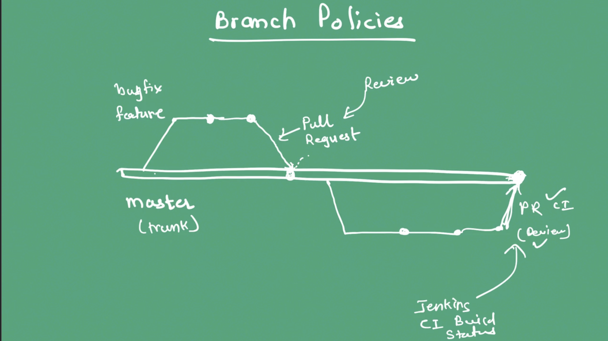
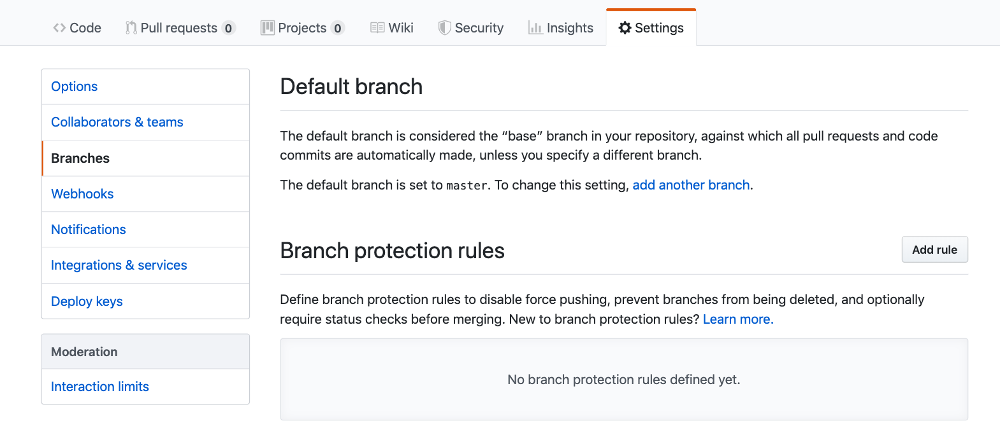
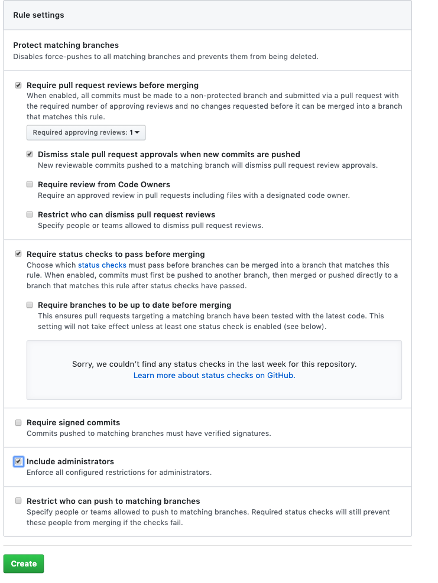
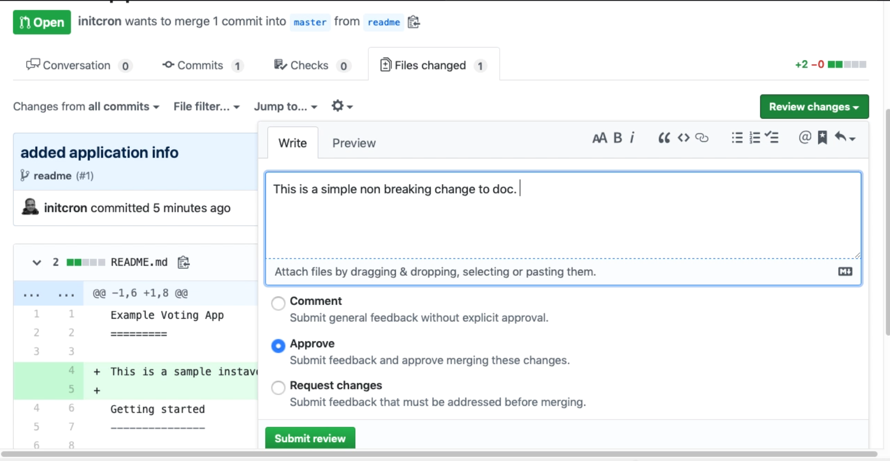
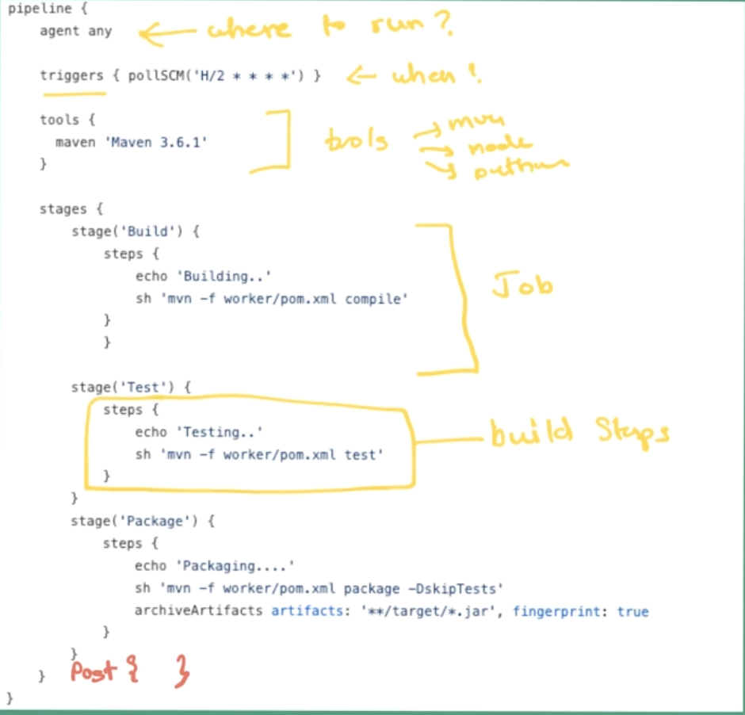
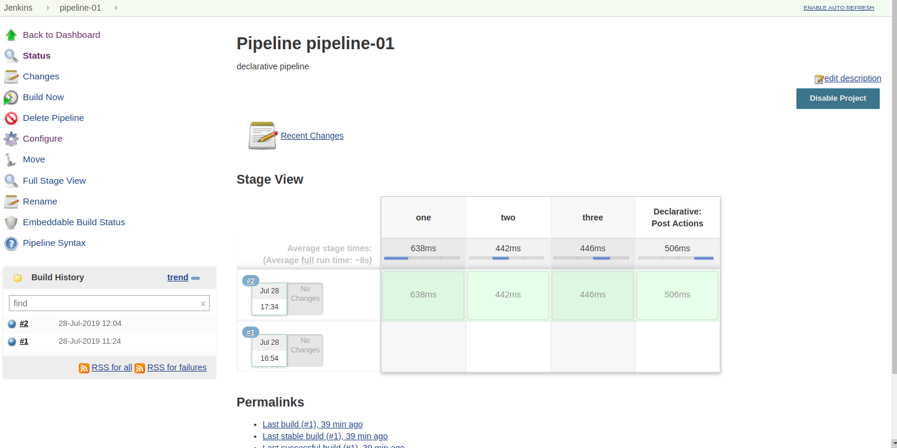
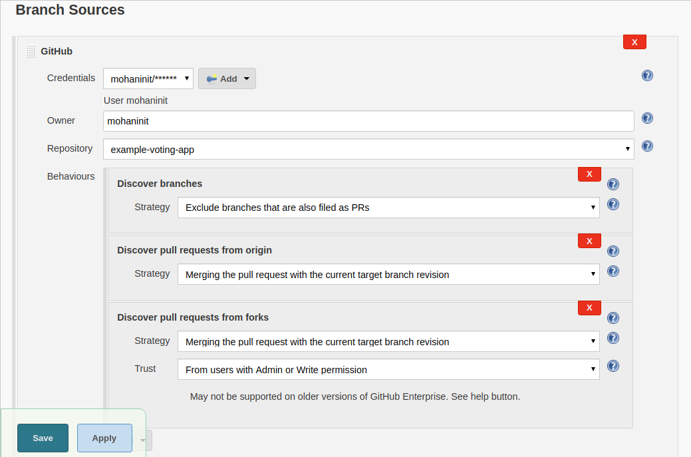
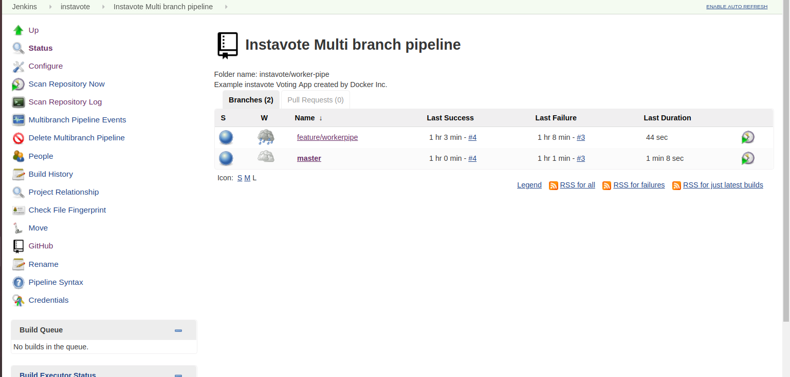

# Pipeline as a Code with Jenkinsfile
---

Here is what you are going to learn in this lab,

  * You would begin by defining branch protection rules on GitHub
  * Then you would learn about enforcing code reviews via raising pull requests
  * You would then start learning how to write pipeline as a code
  * Learn the syntax to write declarative Jenkins pipeline
  * Create Jenkinsfiles for a Java and NodeJS applications
  * And finally launch  it with multi branch pipelines  on Jenkins


## Enforcing Workflow with Branch Policies

**Reading List**:

  * [Web: Guide to Trunk Based Development](https://trunkbaseddevelopment.com/)    
  * [Video: Trunk Based Development Explained](https://youtu.be/ykZbBD-CmP8?t=306)  


Lets create branch policies based on trunk based development workflow. With trunk based development,

  * Master branch is the trunk/main line of code, which is locked. No direct checkins to master allowed.
  * Every bugfix gets its own branch
  * Every feature gets its own branch too
  * Features branches are typically short lived
  * Merges to master require pull request
  * Further policies could be added to enforce the code review as well as integrate with jenkins ci to run per branch pipeline

This is how it should look like,


To define the branch policies,

  * Goto settings for your github repository and select **branches** options
  

  * From **Branch Protection Rules** section, click on **Add rule** button.

  * Add the following set of rules
    * Require Pull request reviews before merging
      * Dismiss stale pull request approvals when new commits are pushed
    * Require status checks to pass before merging
    * Include Administrators

  The following image depict the branch protection rules 


### Testing Branch Protection Rules

You need to clone the repository to your machine if you are not cloned before. Once you have the cloned repository in your local, made some changes in your `README.md` file and check and commit those changes once it done by using following commands.
```
git diff
git commit -am "test"
git push origin master
```       
Whenever you are trying to push some changes, it throws an error `master protected branch hook declined`, because you can't directly push to master and atleast it should be approved by at least  one reviewers.

Now you need to reset your commit by using previous commit id.
`replace YOURLASTCOMMITID with the actual commit id following `

```
git log
git reset --hard YOURLASTCOMMITID
```  


Once you done hard reset, it will back to your previous commit.

## Code Reviews with Pull Requests

With this sub section, you will learn how to make changes in master branch by using code reviews and pull requests. You'r task this time is just to update the existing README.md file to the project and incorporate those changes to the trunk i.e. master branch.

   * Create a branch `readme` using  command following,

```
   git checkout -b readme
```

   Running this command, git will create and switch to the *readme* branch.

  * Update the `README.md` file by adding a description of the app.

   e.g.

   `filename: README.md`


```

   Example Voting App
   =========

   This is a sample voting app.
```


  * Save and  commit the  changes you have made.

```
  git status
  git commit -am "added application info"
  git push origin readme
```
  This pushes the changes to  `readme` branch of the repo on GitHub.

  * Now go to the github repository and choose branch `readme`, there you should see `new pull request`. The pull request is to help you to merge those changes from the feature branch to master, to the upstream repo you forked,  or even to a completely differnt fork.

  * Select `new pull request` and choose your base as master branch, add the description and create pull request.

  * Add a reviewer: Creating a pull request does not allow you to merge immediately. It would demand a code review which is been manadated as part of the branch protection rules you have set. Add at least one of your collaborators as a reviewer. If you do not have a collaborator, create another account on GitHub, configure it as a collaborator, and add it as a reviewer.  

  * Request a review. If you are the reviewer, go to pull requests,  review the changes and approve.
  

After approval  you could  merge the pull request to master. You could delete the branch after merge.


## Writing Pipeline as a Code


**Reading List**:

  * [Declarative Pipeline Syntax](https://jenkins.io/doc/book/pipeline/syntax/)  
  * [Declarative Pipeline Steps](https://jenkins.io/doc/pipeline/steps/workflow-basic-steps/#dir-change-current-directory)  


Following is an example pipeline code. Examine it  to learn how to create a Jenkinsfile and define the jobs as a code.


Some of the important directves are,

  * Pipeline
  * Agent
  * Tools
  * Stages | Stage | Steps
  * Post

### Creating a sample declarative pipeline

In this sub section  you will learn how to create and execute a declarative pipeline.

Begin by creating a sample pipeline job. To create it, go to jenkins page and select new item to create `pipeline-01` job, while creating pipeline job use project as `pipeline`

goto  `pipeline-01` configuration page, in pipeline step choose `hello-world` script and save the configuration to run the build. Once you run the build it will successfully build helloworld job.

Now you are going to write declarative pipeline, visit [declarative pipeline](https://jenkins.io/doc/book/pipeline/syntax/) for your reference.

Use the following code to configure your pipeline job.

```
pipeline {
  agent any

  stages{
      stage(one){
          steps{
              echo 'step 1'
          }
      }
      stage(two){
          steps{
              echo 'step 2'
          }
      }
      stage(three){
          steps{
              echo 'step 3'
          }
      }
  }

  post{
    always{
        echo 'This pipeline is completed..'
    }
  }
}
```


After configure the job, build it view the stage view to know how the pipeline works and how much time it will take to complete the job.


Now add some additional step like `sleep time` with the same job, refer following code for the configuration. Save the configuration and build the job for the result.
```
pipeline {
  agent any

  stages{
      stage(one){
          steps{
              echo 'step 1'
              sleep 3
          }
      }
      stage(two){
          steps{
              echo 'step 2'
              sleep 9
          }
      }
      stage(three){
          steps{
              echo 'step 3'
              sleep 5
          }
      }
  }

  post{
    always{
        echo 'This pipeline is completed..'
    }
  }
}
```
you could see the time interval between each steps in stage view and select to see a specific stage logs.


### Jenkinsfile for a Java App


With this section,  your will define pipeline as a code for a java  worker app  which uses maven as a build tool.

Create new `feature/workerpipe` branch, by using following command,

```
git checkout -b feature/workerpipe
git branch
```

Now you are going to write Jenkinsfile for worker application using previous sample code the following steps to write Jenkinsfile.

**Steps:**

Create a Jenkisfile inside `worker` dir of your code. Before you start writing the code, check your maven version in your jenkins `Manage Jenkins --> Global Tools Configurations -> Maven`  and note down the exact name you are referring to the configuration (e.g. Maven 3.6.2).


`file: worker/Jenkinsfile`

```
pipeline {
  agent any

  tools{
    maven 'Maven 3.6.2'

  }

  stages{
      stage("build"){
          steps{
              echo 'Compiling worker app'
              dir('worker'){
                sh 'mvn compile'
              }
          }
      }
      stage(two){
          steps{
              echo 'Running Unit Tets on worker app'

          }
      }
      stage(three){
          steps{
              echo 'Packaging worker app'

          }
      }
  }

  post{
    always{
        echo 'Building multibranch pipeline for worker is completed..'
    }
  }
}
```     

Once you created Jenkinsfile, commit the file and push the changes to `feature/workerpipe`

```
 git status
 git add worker/Jenkisfile
 git commit -am "added Jenkinsfile for worker with build job"
 git push origin feature/workerpipe
```

## Multi Branch Pipeline Project

With this section,  you are going to create and  execute a multi branch pipeline which

  * scans your repository automatically for Jenkinsfile
  * setup the pipeline jobs for the branches which contain the above pipeline script
  * start executing the CI jobs  

Refer to the  following steps to create a  multi branch pipeline.

** Steps:**

  * Create a new job `worker-pipe` in your instavote directory, choose project type as multibranch pipeline.
  * In the  job configuration page,  under the branch sources choose `GitHub`,  add your account credentials, and choose the  project repository. example image is given following,

  * Under build configuration, mention your Jenkinsfile path as `worker/Jenkisfile`.
  * Add periodical checks interval as `5 minutes` under **Scan multibranch pipeline** triggers and save the configuration,

it will automatically scan your repository. Whenever it detects new branch under repository, it  scans and runs the pipeline build automatically.

Once the pipeline run is succesful, add two more jobs in the same Jenkinsfile viz.  `mvn clean test` and `mvn package`

```
pipeline {
  agent any

  tools{
    maven 'Maven 3.6.2'

  }

  stages{
      stage("build"){
          steps{
              echo 'Compiling worker app..'
              dir('worker'){
                sh 'mvn compile'
              }
          }
      }
      stage("test"){
          steps{
              echo 'Running Unit Tets on worker app..'
              dir('worker'){
                sh 'mvn clean test'
              }

          }
      }
      stage("package"){
          steps{
              echo 'Packaging worker app'
              dir('worker'){
                sh 'mvn package'
              }

          }
      }
  }

  post{
    always{
        echo 'Building multibranch pipeline for worker is completed..'
    }
  }
}
```

After making changes in Jenkisfile, commit the file from your `feature/workerpipe` and push the changes into the same branch.

```
 git status
 git add worker/Jenkisfile
 git commit -am "added Test and package job for worker pipeline"
 git push origin feature/workerpipe
```

Once you push the changes to `feature/workerpipe` branch, webhook/scan  will automatically trigger the `feature/workerpipe` branch build in instavote multibranch pipeline.

Now after running package, it will create jar/war file. You need to archive that artifact and for your feature use, you could download that file from jenkins.

```
pipeline {
  agent any

  tools{
    maven 'Maven 3.6.2'

  }

  stages{
      stage(one){
          steps{
              echo 'Compiling worker app..'
              dir('worker'){
                sh 'mvn compile'
              }
          }
      }
      stage(two){
          steps{
              echo 'Running Unit Tets on worker app..'
              dir('worker'){
                sh 'mvn clean test'
              }

          }
      }
      stage(three){
          steps{
              echo 'Packaging worker app'
              dir('worker'){
                sh 'mvn package -DskipTests'
                archiveArtifacts artifacts: '**/target/*.jar', fingerprint: true
              }

          }
      }
  }

  post{
    always{
        echo 'Building multibranch pipeline for worker is completed..'
    }
  }
}
```

Commit the chanegs to `feature/workerpipe` and push to the branch.

```
git status
git add worker/Jenkisfile
git commit -am "archive artifacts, skiptest and package"
git push origin feature/workerpipe
```

You have setup a multibranch pipeline so that the CI pipelines are run automatically for every branch that you create in future. This is extremely useful to get the feedback from CI system even  before you merge the code into the trunk. This should  get rid of master branch with a broken build completely.  


### Configuring Conditional Execution of Stages

As with the current configuration, the pipeline you have created will launch for any and every change committed to the repository. However, it makes sense to restrict that only to the subset of changes made for the worker application. Specially a desirable feature with mono repositories which contain multiple sub projects.

You may also want to restrict certain jobs to run only on specific branches e.g. integration and acceptance tests should run only for the master branch, packaging applications to create and distribute artifacts also is relevant only for the master branch.

How to achieve that is by setting up conditional execution. You are going to  define following conditionbs for the worker pipline,

  * run packaging job only on master
  * run the jobs in this pipeline only if code in worker subdir is updated

Read the description of  **when** directive in the Jenkinsfile documentation for reference before you start refactoring the code as follows,   


`file: worker/Jenkinsfile`

```
pipeline {
  agent any

  tools{
    maven 'Maven 3.6.2'

  }

  stages{
      stage(one){
        when{
            changeset "**/worker/**"
          }

        steps{
          echo 'Compiling worker app..'
          dir('worker'){
            sh 'mvn compile'
          }
        }
      }
      stage(two){
        when{
          changeset "**/worker/**"
        }
        steps{
          echo 'Running Unit Tets on worker app..'
          dir('worker'){
            sh 'mvn clean test'
           }

          }
      }
      stage(three){
        when{
          branch 'master'
          changeset "**/worker/**"
        }
        steps{
          echo 'Packaging worker app'
          dir('worker'){
            sh 'mvn package -DskipTests'
            archiveArtifacts artifacts: '**/target/*.jar', fingerprint: true
          }

        }
      }
  }

  post{
    always{
        echo 'Building multibranch pipeline for worker is completed..'
    }
  }
}
```
Once you make changes, commit the changes to `feature/workerpipe` and push to GitHub.
```
git status
git add worker/Jenkisfile
git commit -am "run package step only on master, run stages only worker changes "
git push origin feature/workerpipe
```

After making this changes, you would notice that the build it will run only for first two stages and  skip package stage with artifacts.

`Warning: Even though Jenkinsfile is part of the worker subpath, its not considered as part of the changeset to trigger the builds. You would need to make changes to other files in order to see the jobs being triggered.`

You could make some changes in README.md file in root directory and commit those chanegs, push into `feature/workerpipe`. Build will be trigger but it will skip all three stages.

You don't need this conditional build always, use git log and reset to go back your previous commit.

```
git log
git reset --hard yourlastcommitid
git push origin feature/workerpipe -f
```

Now you have learned how to use conditional pipeline stages.


## Assignment: Writing  Jenkinsfile for result app

You have been tasked to write declarative pipeline for **result**, a nodeJS application.

  *  Install NodeJS plugin and configure 'NodeJS 8.9.0' from **Global Tools**.
  *  Add two stages, build (npm install) and test (npm test)
  * Stages should run conditionally only when there is a change to **result** subdir
  * You could refer the  workflow following


[You could reference this page to observer the solution.](./solutions/jenkinsfile-nodejs.md)
