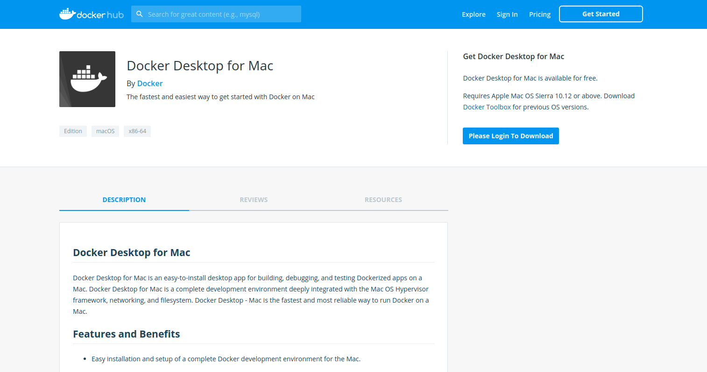
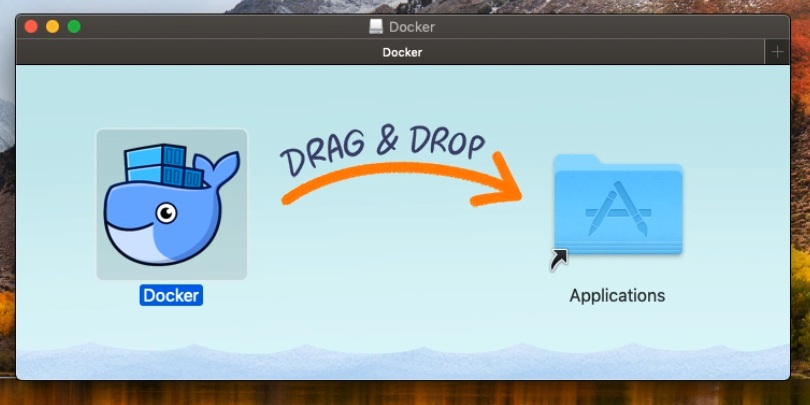

# Creating learning environment

In this lab, you will learn,

  * how to install docker desktop on MacOS
  * creating a google cloud account and optionally
  * how to configure vm on GCP and install docker on linux vm.

### Install Docker Desktop on MacOS

In this subsection, you would learn how to setup  **Docker Desktop** on MacOS. However, you could follow similar instructions for Windows as well,

  * Vist [Docker Desktop Portal](https://www.docker.com/products/docker-desktop, an official page for the software.
  * Click on Download Desktop for Mac and for Windows button, which would take you to docker hub



Use your docker hub credentials to log in and download the docker from docker hub. If you have not signed up to docker hub, its a good time to do so.

Download the dockerdesktop installer form docker hub and move the docker to applications directory on mac os.


Once the docker daemon start, launch a terminal and  validate the docker by running the following commands on your terminal.

```
* docker version
* docker run hello world
```

Now `docker run hello world` runs the smoke test and it will gives the result, so this is how you could install docker on MacOS and validate.

### Creating a Google Cloud Account

Here you will learn how to create a google cloud account. Prerequisite for this is you should have a google  account.

Visit [google-cloud](https://cloud.google.com/) to create a google cloud account, get started with free account and signup to get free **$300 credit** which is valid for whole one year.

While creating account choose a account type as `individual` and provide your address, payment details to complete the signup.  

Once you create google cloud account, you will get console access. Goto the console page, there you could see profile details, notifications and left side you could see services that are provided in gcp.

Now you are created your first GCP account, goto your gmail & complete your profile info and get start working on VM.
