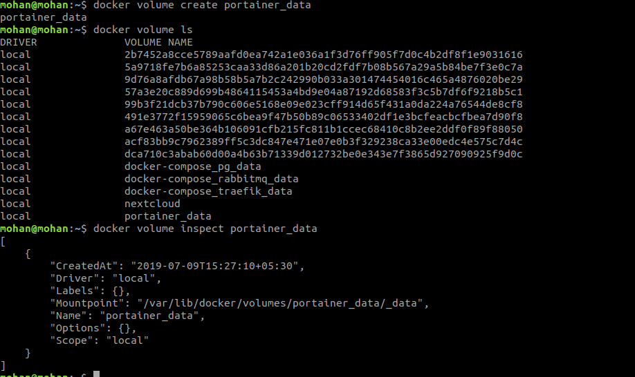

### Setting up nextcloud

 Previously you have some understanding about running application using containers, here you will setup nextcloud application using official image with creating volume and mounting inside the container.

 You just follow the below procedure to Setting up nextcloud.
 ```
 docker container run -idt -P -v nextcloud:/var/www/html nextcloud
 ```
 

 Use below commands to get running container port and logs.
 ```
 docker ps
 docker logs ac69
 docker logs -f ac69
 ```
 `Example:` you can visit the application buy using `localhost:32770` on your browser.
 

### Portainer with advanced run option
Here you will launch and practice more advanced run option by using portainer application.

Firts you need to create a volume before running a container and validate the volume by using below commands.
```
* docker volume create portainer_data
* docker volume ls
* docker volume inspect portainer_data
```


 After creating the volume you just run the `docker run` command along with the volume which we are created.
 ```
 docker run -d -p 9000:9000 -v /var/run/docker.sock:/var/run/docker.sock -v portainer_data:/data portainer/portainer
 ```
Once you created your container, then access the portainer application using port 9000 on your browser.

 `example:- localhost:9000`

