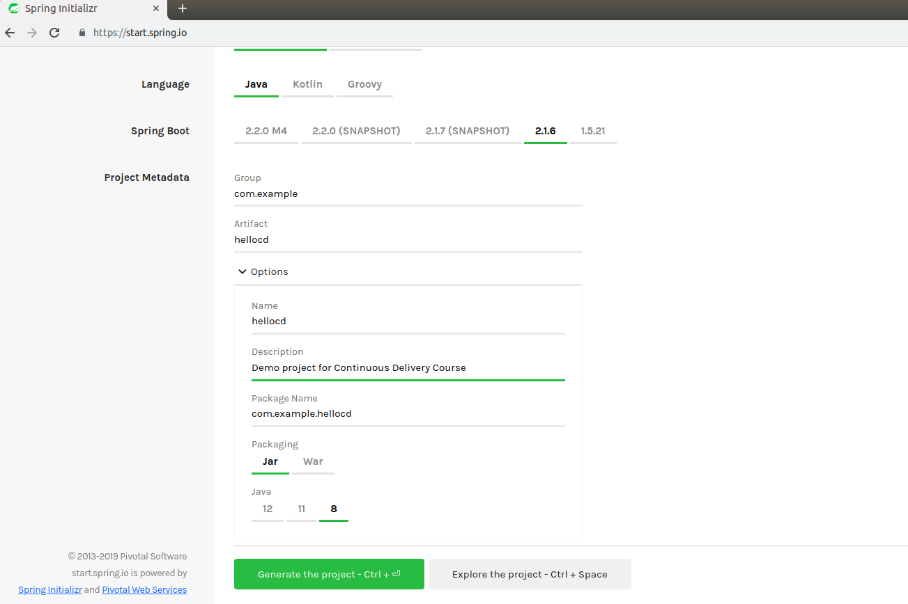
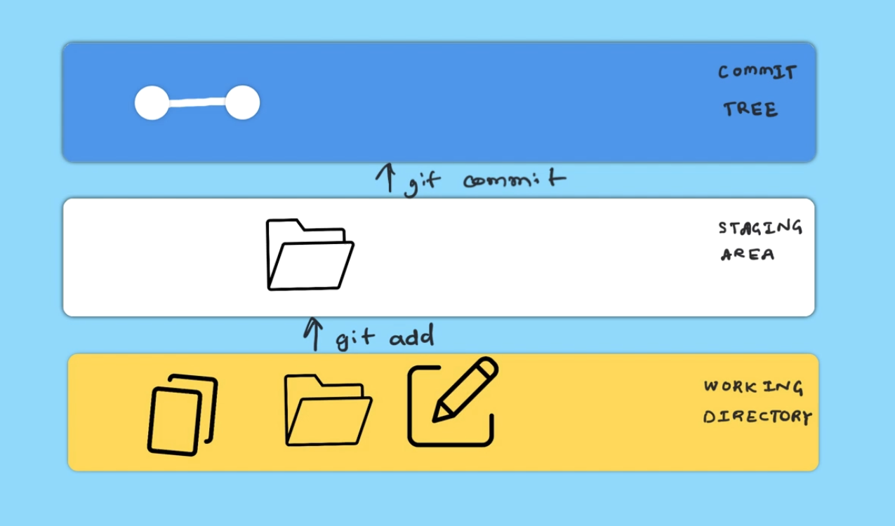
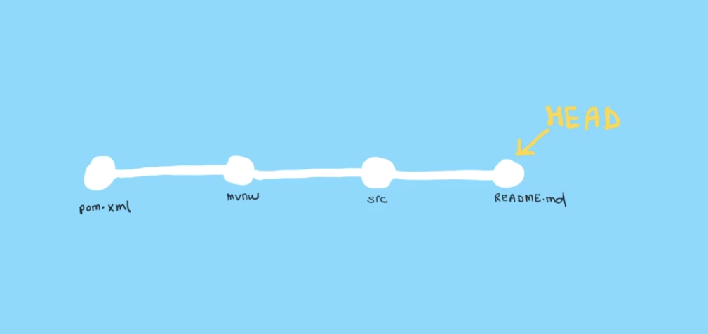
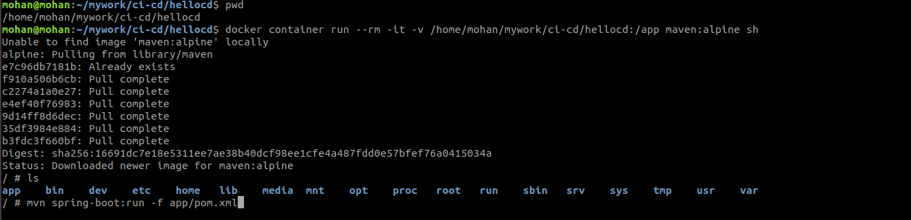
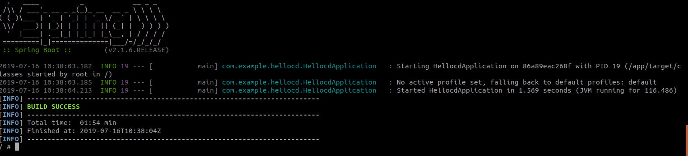
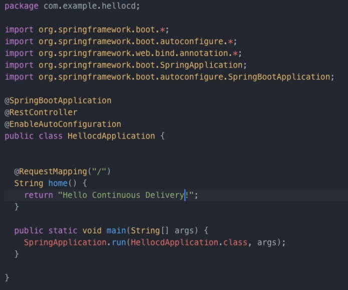
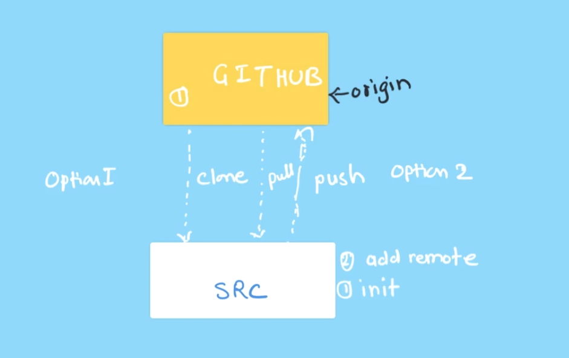
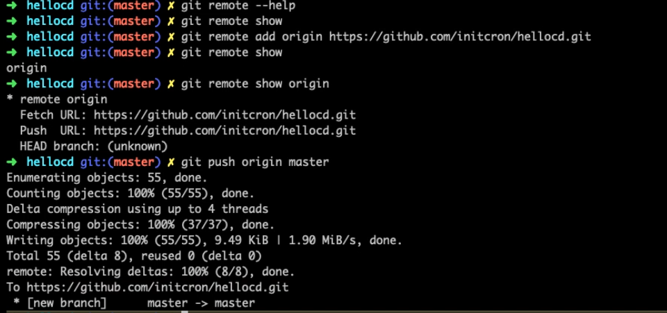
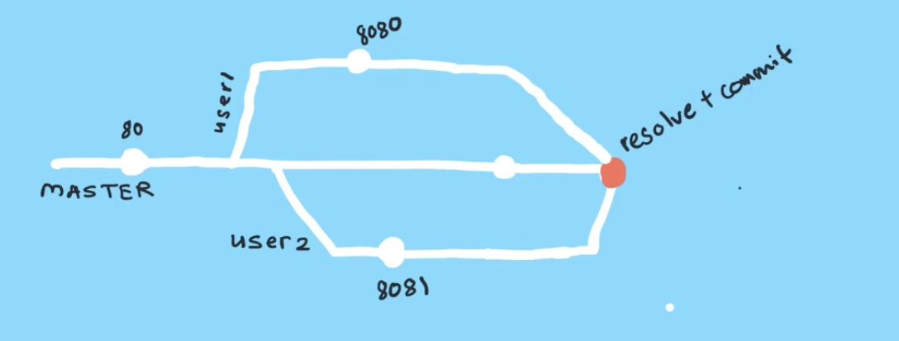

# Revision Control with Git
In this lab, you will learn how to configure git and the complete work flow of git like, three trees of git and how to simplyfy development by using branch based development. you will also learn merging to master branch,collaborating and syncing changes with remotes.This will help you to get good understanding about revision control.
### Configuring git client :-
Before you are start revision control, you need to configure git.There are three different places you can configure git, that are explained here and you just follow below method to configure git.

Git configs:-
```
 USER -->  .git/config
 USER -->  /home/user/.gitconfig
 HOST -->  /etc/gitconfig
```
Here you will configure git globally to your specific USER.
```
 git config --global user.name "username"
 git config --global user.email "user@gmail.com"
 git config -l
 cat ~/.gitconfig
```
You could use editor for git configuration.
```
 git config --global core.editor vim
 git config -l
 git config -e --global
```
Here you will create a simple hello-world application using java based spring boot framework.To create the application visit [startspringboot](https://start.spring.io/).

Once you vist that page, change your artifact name and description. Click Generate the project to download your application.

After downloaded your application, move that zip file to your ci-cd directory and unzip that application. you will use this application for revision control operations and writing simple web application.  
```
unzip hellocd.zip
```
### Basics of revision control :-
you already have a hellocd application on your ci-cd directory, you are going to use that application for this revision control operations.

first you will check your git status but you don't have a git repository for this application, so you need to initialize git repository and check your status.
```
 git init .
 git status
```
Once you check git status it will show untracked files, so you need to add the files to upload your git repo by using add and commit.you could use below commands to git add,commit ,status and git logs.once you are using git commit it will open editor and add your commit message over there.
```
 git add pom.xml
 git commit
 git status
 git add src
 git add *
 git commit mvnw
 git commit -am "adding files created with spring boot generator"
 git log
```
### Three trees of git-Working,staging,commit :-
Previously you are added and commited all files using git command, now you are going to learn about three trees of git.

Once you are in your working directory, you added the file to staging area and then you commited that file to commit tree.we added picture below for your best understanding.


git logs will shows you commit history and git status show you new file or untracked file in your directory. you just add one more file in your working directory `README.md`and then check your git status after that commit that using reset.
```
 git add README.md
 git status
 git reset README.md
 git add README.md
 git commit -am "adding README"
```
In this you have added and commited the files one by one, that flow chat is given below and this is the current state of your repository.

### Using docker in development :-
You have a java project based on maven, now you are going to build this by using mvn build tool. you don't need to install maven on your local environment, you could use a container for this with source code volume.

Use the below command to run the container, before that you need absolute path for source code, for that use `pwd` commad for finding your absolute path.  
```
docker container run --rm -it -v /absolute/path/to/ci-cd/hellocd:/app maven:alpine sh
```
Once you run the above command, you will get shell and run given below maven spring boot command.
```
 mvn spring-boot:run -f app/pom.xml
```

Once you run `mvn spring-boot:run -f app/pom.xml` it will take few minues to finish the buid and you will get below screen,

you could see your libraries are stored in `/root/.m2/` directory. you can reduce the time to download libraries by creating and adding one more volume `m2` while running container.
```
 docker volume create m2
 docker container run --rm -it -v m2:/root/.m2 -v /Users/gouravshah/learn/ci-cd/hellocd:app maven:alpine mvn spring-boot:run -f /app/pom.xml
```
you could run `docker cntainer run` again and again after created `m2` volume, it will speed up your process.
### Getting started with branching :-
Here you have local docker based development environment along with your souce code, now you can start writing some features add some code and test it locally with this environment.safely develope a new feature you can use the branching model.

You could create branch using `git branch` command and switch it to that branch using `git checkout`. Always default branch is master, whenever you need to work on other branch that time you could use `git checkout`.
```
 git branch --list
 git log
 git branch webapp
 git branch --list
 git branch checkout webapp
```
You can delete your branch using `git branch -d`, before delete the branch you need to switch the branch.
```
git branch -d webapp
```
You could use below command for creating branch as well as switch to that newly created branch.
```
git checkout -b webapp
```
Now you are going to change some features in your application,
  step 1: source code changes visit [lfs261devops-repo](https://github.com/lfs261/devops-repo) and goto `hellocd` directory copy `HellocdApplication.java.v1` code and replace the `HellocdApplication.java` in your `src/main/java/com/example/hellocd directory`.
  step 2: copy `pom.xml.snippet1` in that url and add the snippet in your `pom.xml`file under dependency section.

Now you can check your git status, the result will be like those files you are chnaged that are in untracked files. You can check changes by using `git diff` and you could commit after `git add` else directly commit by using `git commit -a` with the editor.
```
 git add pom.xml
 git commit -a
 git status
```
Now you can see the changes in new branch, and master doesn't have any changes in it previous commit.This is the safer way of bringing your code to master.
### Merging with commit history :-
Previously you have made some changes and commited in new branch webapp, now you are going test that application.

Again run the same spring-boot container command with port mapp `8080`,
```
docker container run --rm -it -v m2:/root/.m2 -v /Users/gouravshah/learn/ci-cd/hellocd:app -p 8080:8080 maven:alpine mvn spring-boot:run -f /app/pom.xml
```
Once the container is running you can visit the application on `localhost:8080`, but you will get some error due to some snippet missing on `HellocdApplication.java`, so you just copy `HellocdApplication.java.v2` from the devops-repo and replace eniterly. After replacing the snippet run the below commands to commit.
```
 git diff
 git commit -am "added missing annotations"
```
Again run your sping-boot container and visit `localhost:8080`, now you can able to see hello world on your browser.

You could change the `hello Continuous Delivery` insted of `hello world` in `HellocdApplication.java` and commit that, again run your container. Now you can able to see `hello Continuous Delivery` on browser.


your feature is successfully added, let's commit the changes and bring those to master by using `git merge`, before that switch to your master branch and run this below commands to merge.
```
 git checkout master
 git merge webapp
 git log
```
If you don't want to continue new feature branch then delete that by using `git branch -d`and total branch workflow is given below for your reference.
```
 git branch -d webapp
```

### Syncing with remotes :-
You could colabrate and works with different branches, users or central repository by using remotes.Here your central repository is github, actually you work with is as the remote and clone from github or create the code, initialize and push the code into the github repository.

Before start you need to create account in github, visit the [github](https://github.com/) link to create your account.
while create account use free account option.

Once you create an account, create a new hellocd public repository. You have two ways to work with repository, first is like you could use initialized repository or second one is clone the repository form github and make changes and push to your repository.

Here you are already initialized a repository, now you need to add newly created repository as a origin by using below command and push your application to that origin master,
```
 git remote add origin https://github.com/initcron/hellocd.git
 git remote show
 git remote show origin
 git push origin master
```   

Once you push to origin master, you can see your code in the repository with commit what you have changed.
### Working with github repo :-
Let you create new repository `skills journal`,add a description and init with README file with the license for your public repository.

Once you create repository , clone the repository locally by using below command and add your skills in a file, push to your origin.
```
 git clone https://github.com/mohaninit/skills-journal.git
 git add skills.md
 git commit -am "added skills"
 git remote show
 git remote show origin
 git push origin master
```
You could create more files, commit it and push it in your repository.
### Resolving conflicts :-
Here you will learn how to resolve conflicts with git. whenever you are working with colabration conflicts will happen, git provide you various options to resolve conflicts.

Add `sever.port=80` in `src/main/resource/application.properties` using master branch and run below commands to save changes and validate those changes on your git repo,
```
 git diff
 git commit -am "added server port 80"
 git push origin master
```

You just create two branches called user1 & user2, by using user1 branch change the `server.port=8080` in `src/main/resource/application.properties` and push to your master branch, now using user2 branch change the port `8081` in `src/main/resource/application.properties`.

Use the below code for user1 :-
```
 git checkout -b user1
 git diff
 git commit -am "this should run on port 8080"
 git push origin user1
```
After complete user1 , use this below code for user2 branch,
```
 git checkout -b user2
 git diff
 git commit -am "this should run on port 8081"
 git push origin user2
```
Once you complete both user1 & user2, switch to your master branch and run below commands to merge user2 with matser branch,
```
 git checkout master
 git pull origin user2
 git log
 git push origin master
```
After completing user2, follow the above same procedure to merge user1 with master branch,
```
git pull origin user1
```
This time you will get conflict while merging locally, you could use `git log` for check the conflict. Once you finalize `server.port` then you can change manually in the `src/main/resource/application.properties` file commit those changes and merge them using below command,
```
 git add src/main/resource/application.properties
 git commit -a
 git push origin master
```
Once you complete, goto your git repository and check your commit history. you used manual editing on the file and add & commit the file, finally pushes that code in your master branch. This is how you resolved conflict using manual method and example flow chat is given below for your reference.

Once you complete this, delete your user1 & user2 branches by using below commands,
```
 git branch -d user1
 git branch -d user2
 git push origin --delete user1
 git push origin --delete user2
```
### Undo with git reset :-
Here you will learn how to undo once you add changes from your working directory to staging or once you done commit and you want to reset it back, that time you could use `git reset` to bring it back to your exiting state.

You just create `config` branch and change the `server.port=9000` in your `src/main/resource/application.properties` file and add that file to your using staging using `git add`,
```
 git checkout -b config
 git branch
 git status
 git add src/main/resource/application.properties
 git status
```
Once you done git add and now you want to reset, so you could use `git reset` and bring it back to your exiting state,
```
 git reset src/main/resource/application.properties
 git status
```
Once you complete `git commit` and pushes to the repository, but you have entered port `9000` insted of `8080`, while running container that time you come to know about port. now you want to reset it , that time you could use git reset with `commit history id` or `HEAD`  

```
 git diff
 git commit -am "changed port to 9000"
 git log
 git push origin config
 git reset 5080dcc9d13ac920b5867891166a
            (or)
 git reset HEAD~1
```
If you make reset it will be there in your local machine, that time you need to do hard reset by using below command,
```
git reset --hard HEAD~1
```
Once you reset it back, again if you try to push with same branch you will get error,that time you need to use force push option.
```
git push origin config -f
```
### Reverting Changes :-
Previously you used reset,now you are going to use revert. It is specially useful when you are working with multiple developer with master branch and various other branches, that time you can't use `git reset` in master branch, so you can use `git revert` and make some changes.

Here you are going to learn, difference between `git reset` and `git revert`.

You could config2 branch and change the `service.port=7000` in `src/main/resource/application.properties` file and commit the changes in feature branch, bring those changes to master branch using below commands,
```
 git checkout -b config2
 git diff
 git commit -am "run on port 7000"
 git push origin config2
 git pull origin config2
 git push origin master
```
Now you are merged with master branch and you need to revert it back, so follw below commands to revert back.
```
 git log
 git revert HEAD
      (or)
 git revert 5080dcc9d13ac920b5867891166a
```
Once you revert back, you need to save the changes in master branch by using below command.
```
 git log
 git push origin master
```
Once you make change, it will show the changes to your co-developer and delete your config2 branch after git revert.
```
 git branch delete config2
 git push origin :config2
```
