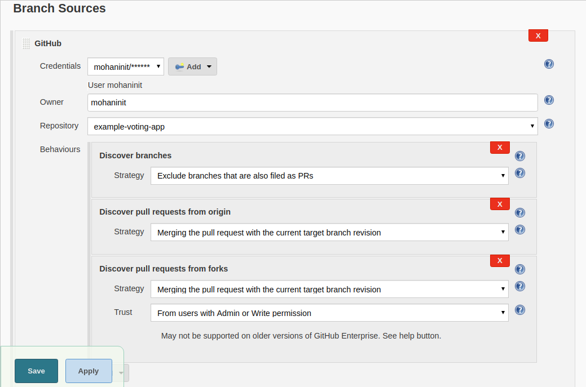

# Pipeline as a Code with Jenkinsfile
---

Here is what you are going to learn in this lab,

  * You would begin by defining branch protection rules on GitHub
  * Then you would learn about enforcing code reviews via raising pull requests
  * You would then start learning how to write pipeline as a code
  * Learn the syntax to write declarative Jenkins pipeline
  * Create Jenkinsfiles for a Java and NodeJS applications
  * And finally launch  it with multi branch pipelines  on Jenkins


### Enforcing branch policies

Lets create branch policies based on trunk based development workflow. With trunk based development,

  * Master branch is the trunk/main line of code, which is locked. No direct checkins to master
  * Every bugfix gets its own branch
  * Every feature gets its own branch too
  * Features branches are typically short lived
  * Merges to master require pull request
  * Further policies could be added to enforce the code review as well as integrate with jenkins ci to run per branch pipeline

Goto settings form your github repository and add rule form branch protection rules. In the rule add require status check to pass before merging, include administrators and create the rule with your password.

you could see branch rule under branches once the rule created.

You need to clone the repository to your machine if you are not cloned before. Once you have the cloned repository in your local, made some changes in your `README.md` file and check and commit those changes once it done by using below commands.
```
git diff
git commit -am "test"
git push origin master
```       
Whenever you are trying to push some changes, it throws an error `master protected branch hook declined`, because you can't directly push to master and atleast it should be aproved by one reviewers.

Now you need to reset your commit by using previous commit id.
`replace YOURLASTCOMMITID with the actual commit id below `

```
git log
git reset --hard YOURLASTCOMMITID
```  


Once you done hard reset, it will back to your previous commit.

### Code reviews with pull requests

Here you will learn how to make changes in master branch by using code reviews and pull requests. Previously you are trying to push changes to master branch after creating branch protection policy, but now your are going to do it in right way.

Create a branch `readme` using  command below,
```
git checkout -b readme
```
Once you create branch `readme` using git checkout, it will create and switch the branch from master to readme.

you make some changes in `README.md` file  and commit those changes. Once you commit the changes, now push that to readme branch using below commands.  
```
git status
git commit -am "added application info"
git push origin readme
```
Now you can  push  changes to `readme` branch.

Now goto your github repository and choose branch `readme`, there you could see `new pull request`. The pull request is help you to merge those changes form other branch to master branch.

Select `new pull request` and choose your base as master branch, add the description and create pull request.


If you are in a part of organization, that time you could add collabrator as a part of your project and assign them as a review.   


You could add your collaborator as reviewer from your main account. goto your main account github repository, in that select pull request and add your team member as your reviwer.

Now from your collaborator account, goto pull requests and review the changes and approve. After approval  you could  merge the pull request to master.


you could delete the branch after merge.


## Writing Pipeline as a Code

Here you will learn declarative pipeline syntax for jenkins.


Here you have a example pipeline image, view the example pipeline to know where to run the job, when to run and what are the tools and build steps that need to run.


### Creating a sample declarative pipeline

Here you will learn how to create and execute declarative pipeline.

To create pipeline, goto jenkins page and select new item to create `pipeline-01` job, while creating pipeline job use project as `pipeline`

goto  `pipeline-01` configuration page, in pipeline step choose `hello-world` script and save the configuration to run the build. Once you run the build it will successfully build helloworld job.

Now you are going to write declarative pipeline, visit [declarative pipeline](https://jenkins.io/doc/book/pipeline/syntax/) for your reference.

Use the below code to configure your pipeline job.
```
pipeline {
  agent any

  stages{
      stage(one){
          steps{
              echo 'step 1'
          }
      }
      stage(two){
          steps{
              echo 'step 2'
          }
      }
      stage(three){
          steps{
              echo 'step 3'
          }
      }
  }

  post{
    always{
        echo 'This pipeline is completed..'
    }
  }
}
```
After configure pipeline job, build the job and view the stage view to know how the pipeline works and how much time it will take to complete the job.


Now add some aditional step like `sleep time` with the same job, refer below code for the configuration. Save the configuration and build the job for the result.
```
pipeline {
  agent any

  stages{
      stage(one){
          steps{
              echo 'step 1'
              sleep 3
          }
      }
      stage(two){
          steps{
              echo 'step 2'
              sleep 9
          }
      }
      stage(three){
          steps{
              echo 'step 3'
              sleep 5
          }
      }
  }

  post{
    always{
        echo 'This pipeline is completed..'
    }
  }
}
```
you could see the time interval between each steps in stage view and select to see the purticular stage logs.

This is the sample pipeline, next you are going to setup pipeline for java application.

### Build pipeline for java App


Here your will learn how to create build pipeline for a java app and that is your worker application writen in java, which uses maven as a build tool.

Create new `feature/workerpipe` branch, by using below command,
```
git checkout -b feature/workerpipe
git branch
```
Now you are going to write Jenkinsfile for worker application using previous sample code and follow the below steps to write Jenkinsfile.

Steps :-
Create jenkisfile inside `worker` dir
Here your build tool is maven, so check your maven version in your jenkins `Manage jenkins --> global configuration` page and add the maven in your jenkisfile under tools with the exact version.
you need to add the compile step in your first stage, to run the `mvn compile` you need to provide exact path, for that use `dir` and mention your directory with the name and command that needs run the `mvn compile`. Use the below code in your jenkinsfile.
```
pipeline {
  agent any

  tools{
    maven 'maven 3.6.1'

  }

  stages{
      stage(one){
          steps{
              echo 'Compiling worker app'
              dir('worker'){
                sh 'mvn compile'
              }
          }
      }
      stage(two){
          steps{
              echo 'Running Unit Tets on worker app'

          }
      }
      stage(three){
          steps{
              echo 'Packaging worker app'

          }
      }
  }

  post{
    always{
        echo 'Building multibranch pipeline for worker is completed..'
    }
  }
}
```     
Once you created Jenkinsfile, commit the file and push the changes to `feature/workerpipe`, then you just create a pull request from your master branch and apporve it by using your another account. Use the below code to push the changes to `feature/workerpipe`.
```
 git status
 git add worker/Jenkisfile
 git commit -am "added Jenkinsfile for worker with build job"
 git push origin feature/workerpipe
```
Now the pull request is approved and merge with your master branch.

### Launching a multi branch jenkins pipeline :-
Here you are going to learn, how to create & execute multi branch pipeline and how to use this with ci pipeline for every branch that you have in github repository.

Follow the below steps to create and execute multibranch pipeline.

Steps: -
create new job `worker-pipe` in your instavote directory, choose project type as multibranch pipeline.
In `worker-pipe` job configuration page , add display name as 'Instavote Multi branch pipeline' and under the branch sources choose `GitHub` and add your account credentials, choose our project repository as well. example image is given below, refer the image and configure it.

Under build configuration, mention your Jenkinsfile path as `worker/Jenkisfile`.
Add periodical checks interval as `5 minutes` under Scan multibranch pipeline triggers and save the configuration, it will automatically scan your repository. Whenever it detects new branch under repository, it  scans and runs the pipeline build automatically.

Now you are going to add two more jobs in the same Jenkinsfile, add `mvn clean test` and `mvn package` in stage tow and three.
```
pipeline {
  agent any

  tools{
    maven 'maven 3.6.1'

  }

  stages{
      stage(one){
          steps{
              echo 'Compiling worker app..'
              dir('worker'){
                sh 'mvn compile'
              }
          }
      }
      stage(two){
          steps{
              echo 'Running Unit Tets on worker app..'
              dir('worker'){
                sh 'mvn clean test'
              }

          }
      }
      stage(three){
          steps{
              echo 'Packaging worker app'
              dir('worker'){
                sh 'mvn package'
              }

          }
      }
  }

  post{
    always{
        echo 'Building multibranch pipeline for worker is completed..'
    }
  }
}
```
After making changes in Jenkisfile, commit the file from your `feature/workerpipe` and push the chanegs into the same branch.
```
 git status
 git add worker/Jenkisfile
 git commit -am "added Test and package job for worker pipeline"
 git push origin feature/workerpipe
```
Once you push the changes to `feature/workerpipe` branch, webhook will automatically triggers the `feature/workerpipe` branch build in instavote multibranch pipeline.
In stage view you will get each step logs indvidually.
Now after running package, it will create jar/war file. You need to archive that artifact and for your feature use, you could download that file from jenkins.
```
pipeline {
  agent any

  tools{
    maven 'maven 3.6.1'

  }

  stages{
      stage(one){
          steps{
              echo 'Compiling worker app..'
              dir('worker'){
                sh 'mvn compile'
              }
          }
      }
      stage(two){
          steps{
              echo 'Running Unit Tets on worker app..'
              dir('worker'){
                sh 'mvn clean test'
              }

          }
      }
      stage(three){
          steps{
              echo 'Packaging worker app'
              dir('worker'){
                sh 'mvn package -DskipTests'
              }

          }
      }
  }

  post{
    always{
        archiveArtifacts artifacts: '**/target/*.jar', fingerprint: true
        echo 'Building multibranch pipeline for worker is completed..'
    }
  }
}
```
Commit the chanegs to `feature/workerpipe` and push to the branch. Once chanegs made in git branch, webhook triggers the build automatically and it creates jar file, you could see this in inside your pipeline.
```
git status
git add worker/Jenkisfile
git commit -am "archive artifacts, skiptest and package"
git push origin feature/workerpipe
```
Now you learned how to create & run multibranch pipeline and you also learned how to run the job only for future branch without merging into master branch. You could use and test the feature and finally merge into master branch.


### Configuring conditional execution of stages
Here you will learn, how to execute pipeline stages conditionally. This will helpful when you want to run some feature steps in particular condition.

Now you are going to use conditional statement , when your branch is `master` and whenever the changes in your `worker`, that time only package job should run and others or should run whenever changes in `worker`. Use the below code for your Jenkisfile to achive the successful build.   
```
pipeline {
  agent any

  tools{
    maven 'maven 3.6.1'

  }

  stages{
      stage(one){
        when{
            changeset "**/worker/**"
          }

        steps{
          echo 'Compiling worker app..'
          dir('worker'){
            sh 'mvn compile'
          }
        }
      }
      stage(two){
        when{
          changeset "**/worker/**"
        }
        steps{
          echo 'Running Unit Tets on worker app..'
          dir('worker'){
            sh 'mvn clean test'
           }

          }
      }
      stage(three){
        when{
          branch 'master'
          changeset "**/worker/**"
        }
        steps{
          echo 'Packaging worker app'
          dir('worker'){
            sh 'mvn package -DskipTests'
            archiveArtifacts artifacts: '**/target/*.jar', fingerprint: true
          }

        }
      }
  }

  post{
    always{
        echo 'Building multibranch pipeline for worker is completed..'
    }
  }
}
```
Once you make changes, commit the changes in your branch `feature/workerpipe` and push into the same branch.
```
git status
git add worker/Jenkisfile
git commit -am "run package step only on master, run stages only worker changes "
git push origin feature/workerpipe
```
After this changes, if you notice the build it will run only first two stages and it will skip package stage with artifacts.

You could make some changes in README.md file in root directory and commit those chanegs, push into `feature/workerpipe`. Build will be trigger but it will skip all three stages.

You don't need this conditional build always, use git log and reset to go back your previous commit.
```
git log
git reset --hard yourlastcommitid
git push origin feature/workerpipe -f
```
Now you have learned how to use conditional pipeline stages.

### Integrating slack with jenkins :-
Here you will learn, how to integrate slack with jenkins and this will helpful to send notifications related to your build from jenkins to slack channel.

Prerequsite for this, you need a slack account and you should be the slack channel administrator.

Follow the below steps to complete this setup.
steps:-
create slack account and create a channel with the name of `instavote-cd`.

After creating channel, goto `administrator -> manage apps`. It will open browser,there search `Jenkins CI` and select configure. In this configure page you need to choose your ` instavote-cd` and add jenkins integration, it will show step by step process to setup jenkins configuration.
goto your jenkins, `manage jenkins -> manage plugins -> available plugins` search `slack notification` plugin and install.
goto `manage jenkins -> configure system`, at bottom you could find Gloabal slack notifier settings. copy your `team sub domain` from slack configure page which you got in previous step and add in jenkins page.
Next you need to add integration credential id, that is secret text, add a secret text using integration token credential id given in slack jenkins configuration page.   
Add your channel id as `instavote-cd` and save the configuration.

In browser, slack configuration page save the configuration once you complete jenkins configuration to enable the notification.
Now from your jenkins, choose any job and goto the configuration page add `slack notification` as the post build action. In that slack notification enable all the options which you have.
Once you complete the configuration, save it and build the job. Now you could able to see the notification from your slack channel.

This is how you could integrate slack with jenkins and send notifications to slack channel.

### Sending notifications from a pipeline job :-
Here you will learn how to send slack notification from pipeline job.

Already you have a working pipeline for worker application, now you are going to add some failiure & success postbuild actions in jenkinsfile, this will send notifications to your slack channel. refer the below code to make the changes in your Jenkinsfile .
```
pipeline {
  agent any

  tools{
    maven 'maven 3.6.1'

  }

  stages{
      stage(build){
        when{
            changeset "**/worker/**"
          }

        steps{
          echo 'Compiling worker app..'
          dir('worker'){
            sh 'mvn compile'
          }
        }
      }
      stage(test){
        when{
          changeset "**/worker/**"
        }
        steps{
          echo 'Running Unit Tets on worker app..'
          dir('worker'){
            sh 'mvn clean test'
           }

          }
      }
      stage(package){
        when{
          branch 'master'
          changeset "**/worker/**"
        }
        steps{
          echo 'Packaging worker app'
          dir('worker'){
            sh 'mvn package -DskipTests'
            archiveArtifacts artifacts: '**/target/*.jar', fingerprint: true
          }

        }
      }
  }

  post{
    always{
        echo 'Building multibranch pipeline for worker is completed..'
    }
    failiure{
      slackSend (channel: "instavote-cd", message: "Build Failed - ${env.JOB_NAME} ${env.BUILD_NUMBER} (<${env.BUILD_URL}|Open>)")
    }
    success{
      slackSend (channel: "instavote-cd", message: "Build Succeeded - ${env.JOB_NAME} ${env.BUILD_NUMBER} (<${env.BUILD_URL}|Open>)")
    }
  }
}
```
Once you make changes in Jenkinsfile, commit those changes and push into your `feature/workerpipe` branch.
```
git status
git add worker/Jenkisfile
git commit -am "add slack notifications"
git push origin feature/workerpipe
```
After push the changes to branch, the pipeline will build automatically and send notification to slack. From slack you will get link to visit the build status of your job.

Now your feature is completed, so goto your main github account and create a new pull request. From your second github account review the pull request and merge with master branch. If you create a pull request, it will show in your pipeline as well.

This is how you will send slack notification from pipeline.

### Assignment jenkins for result:-

You have been tasked to write declarative pipeline for result application.

  * Two stages, build and test
  * Stages should run conditinoally only when there is a change to **result** subdir
  * You could refer the  workflow below


