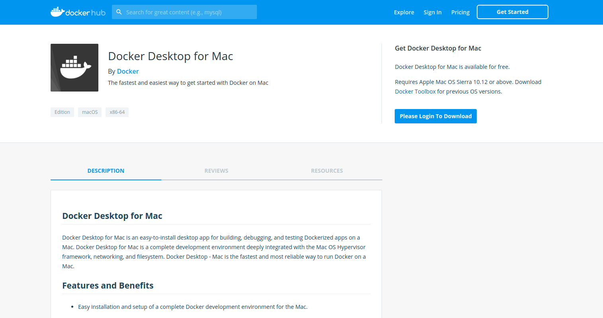
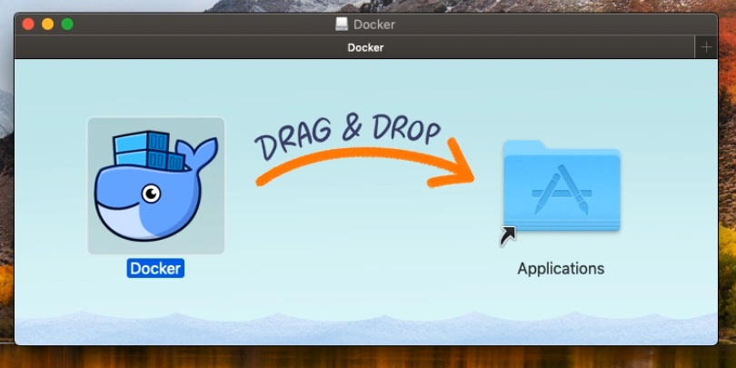

# Creating learning environment :-
In this lab, you will learn how to install docker desktop on MacOS, creating a google cloud account and how to configure vm on GCP and install docker on linux vm.
### Install Docker Desktop on MacOS :-
Here you will learn how to install docker desktop on MacOS and how to vailidate the installation.

Goto the [docker-for-mac](https://docs.docker.com/docker-for-mac/install/) to download docker, there you could see download docker from docker hub.


Use your docker hub credentials to log in and download the docker from docker hub.

Download the docker installer form docker hub and move the docker to applications.


Once the docker deamon start, goto the docker deamon preferences and add how much cpu, memory, swap space that you want to allocate docker and choose system proxy from proxy for your future use.

validate the docker by running the below commands on your terminal.
```
* docker version
* docker run hello world
```
Now `docker run hello world` runs the smoke test and it will gives the result, so this is how you could install docker on MacOS and validate.

### Creating a Google Cloud Account :-
Here you will learn how to creaet a google cloud account. Prerequisite is you need a google mail account.

Visit [google-cloud](https://cloud.google.com/) to create a google cloud account, get started with free account and signup to get free $300 credit limit.

While creating account choose a account type as `indivudual` and provide your address, payment details to complete the signup.  

Once you create google cloud account, you will get console access. Goto the console page, there you could see profile details, notifications and left side you could see services that are provided in gcp.

Now you are created your first GCP account, goto your gmail & complete your profile info and get start working on VM.

### Configuring a VM on GCP :-
